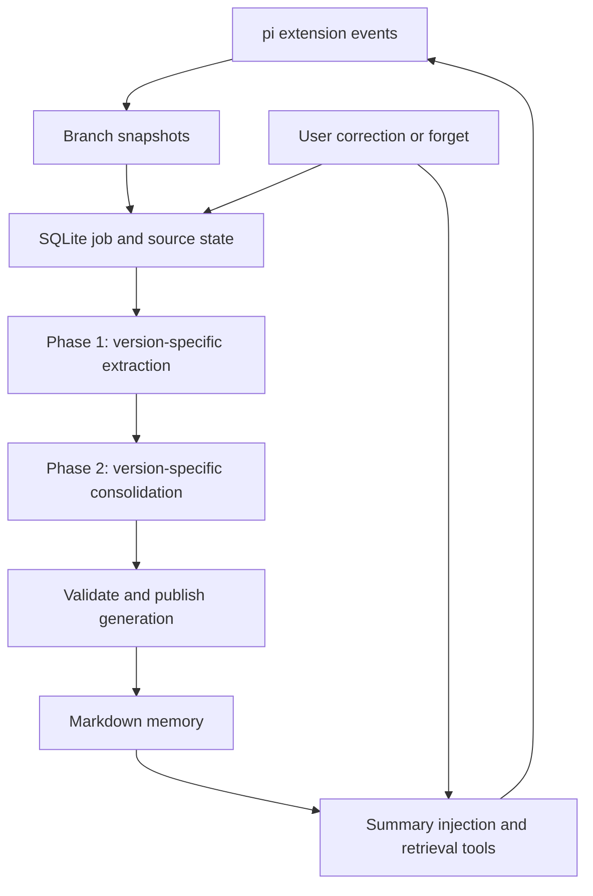

# Pi Memory — Implementation Specification

**Version:** 0.1.0  
**Date:** 2026-09-30

**Revision:** 4 — extension-compatible request-local memory injection and reading

**Status:** Implementation contract; revision 4 approved by the user on 2026-09-30. Revision 3 validation remains signed off. Product implementation and its acceptance tests are pending.

> Implementation authorization update: the user removed exact Pi-version requirements. Support recent daily host releases by the required capabilities, not an exact version allowlist or minimum Pi-version gate. Record the actually exercised host and peer versions as verification evidence; do not require a new multi-version matrix. Historical version references below remain source evidence, not deployment restrictions. Unrelated background/configuration contracts remain unchanged. The user additionally accepts the unavoidable provider cancellation/send race: preserve validation, safe owned-payload removal and best-effort native abort, but do not disable the Codex reader or block acceptance solely because a cached transport can send after cancellation. This exception does not authorize serving a known invalid pin or bypassing read/privacy controls.

**Working package name:** `pi-memory` — a local project name, not a claim that this npm name is available  
**Target:** A single-user TypeScript extension for pi with memory independent of Codex and Claude-mem

## 1. Purpose and agreed decisions

Build a persistent memory system for pi by porting the behavior of Codex CLI's open-source memory pipeline into TypeScript. The system must preserve useful user instructions, project decisions, decision rationale, failures, and unfinished work across sessions without requiring the user to repeatedly say “remember this.”

The user has explicitly selected:

- TypeScript implementation, rather than wrapping a Rust memory executable.
- Independent pi memory data, without sharing Codex's memory directory or database.
- Source-informed implementation using Codex's memory approach.
- A native pi extension as the integration surface.
- Both Codex-style v1 and v2 memory pipelines in the implementation scope.

This document specifies a new implementation. It does not claim that the implementation exists, that the user's installed pi matches the inspected version, or that matching the pipeline guarantees matching Codex's memory quality.

### 1.1 Scope

The v0.1 release MUST implement both memory versions, selectable through configuration. v1 remains the default; v2 is a complete supported pipeline, not a future placeholder. Optional dual writing generates both versions while only the selected version supplies foreground context. The v0.1 release includes automatic capture of participating pi sessions, two-stage LLM processing, file-based progressive retrieval, explicit correction and forgetting, background scheduling, durable job state, bounded model usage, diagnostics, and an evaluation harness.

There is no embedding model, vector database, reranker, HTTP memory server, Docker requirement, or independent resident daemon. SQLite stores coordination and provenance; Markdown stores model-readable memory. Online LLM calls use the configured pi provider runtime.

The first supported deployment is one user on Linux with a local filesystem. Cross-machine synchronization, shared team memory, full-text semantic search, automatic executable-skill generation, byte-for-byte Codex runtime parity, and Claude-mem data migration are outside v0.1.

The existing `proletariat64/pi-bridge` remains a separate Claude-mem adapter. Its lifecycle and failure-isolation lessons are relevant, but this project does not change that repository's responsibilities or reuse its worker protocol.

### 1.2 Signed-off validation change (2026-09-29)

The user approved the revised Phase 2 contract in Sections 9.4–9.6: port Codex's artifact checks rather than adding content-quality heuristics as publication gates. Retain project/date grouping as an explicit, narrowly scoped pi structural adaptation for both versions, and retain one bounded validator-feedback repair. Preserve existing host storage, access, privacy, and publication safeguards separately from generated-content validation. The reader must use the same version-specific artifact contract.

This supersedes revision 2's universal summary cap, ordered-heading gate, generated-reference/ID/anchor checks, handbook-field checks, and per-bullet source requirements. It does not relax Phase 1 JSON schemas or semantic release criteria. Approval records the design, not completion of implementation or tests. Unchanged operational docs, prompt adaptations, and implementation must be reconciled with this revision before the release gate; they do not override it.

### 1.3 Revision 4 injection/read scope

Revision 4 changes only the foreground injection and reading contract, its diagnostics and acceptance definitions. It MUST NOT require modifications to permission extensions, Pi core, the extension architecture, background extraction/consolidation, generated artifact formats, or user configuration. The decision map is [Efficient, extension-compatible memory injection](https://github.com/proletariat64/pi-codex-mem/issues/40); its linked resolution comments are the design record.

The selected mechanism is one request-local custom carrier injected through `context_with_system`, fixed immediately after the leading system message, with no new memory system section or mixed fallback. Default content is a summary under a 2,500-token policy plus read guidance and pin identity. New foreground runs select eligible generations; tool continuations and in-run compaction normally retain the pin. Safety invalidation overrides caching; a narrowly limited background-recovery exception is specified in Section 6.2.3. Both versions can use a sufficient summary directly and retrieve detail only when necessary.

These decisions describe intended behavior, not a completed product fix. The current extension may still implement the superseded section-injection/conflict-disable behavior until separately authorized implementation. Revision 3 artifact-validation rules and unrelated release requirements remain unchanged.

## 2. Inspected source baseline

All upstream descriptions below refer to these exact commits, not an unspecified moving `main` branch.

| Source | Inspected revision | Relevant result |
|---|---|---|
| `earendil-works/pi` | `6f7551516b84278eb9da1c340c8e7bc66be1a6ba` | `@earendil-works/pi-coding-agent` package version 0.87.1; Node requirement >=22.19.0 |
| `openai/codex` | `1cc7e2361237ce7244430ee1d581c77f95c57ac8` | Both memory v1 and v2 are implemented; configuration defaults to v1 |

Revision 3 additionally inspected Codex `c248f6d48b97eb4a2aa56147a0b11b7d763278b9` for artifact validation, writer completion, and nested index formatting [C12]. This supplemental comparison does not repin the vendored prompt families or replace the implementation baseline above.

The source manifest in the implementation MUST record upstream repository, commit, path, content hash, local destination, and a description of every adaptation. The first implementation MUST vendor the relevant prompt templates at these revisions and retain upstream license notices.

Revision 4 additionally inspected the user's installed `@earendil-works/pi-coding-agent` **0.99.1** for extension context ordering, forced projection and custom-message conversion. This inspection is foreground source evidence, not an exact-version acceptance restriction; 0.87.1 remains historical source/reproduction evidence, not a second required host matrix. Supplemental Codex commit `bcd6d9ab6b9f26f85d76d0c680b3f88b367bffa0` confirms default budgeted-summary injection and the 2,500-token summary policy [C13]. Neither supplemental check repins the background implementation or vendored prompt families.

### 2.1 Important findings

1. Codex v1 extracts `raw_memory`, `rollout_summary`, and `rollout_slug`; consolidation produces `MEMORY.md`, `memory_summary.md`, and optionally memory skills. It does not require vector retrieval. [C1–C5]
2. Codex v2 omits `raw_memory` and consolidates summaries into a compact `memory_summary.md`. It is a distinct selectable pipeline, not the default at the inspected commit. v0.1 of this project implements both contracts. [C2, C3, C6]
3. Codex starts memory work asynchronously for eligible root sessions, extracts sufficiently idle previous sessions, and coordinates work in a state database. Consolidation has one global lease and uses workspace changes as its dirty check. [C4, C5, C7]
4. pi extensions are TypeScript modules loaded into the pi process. Factories should register handlers, not start long-lived resources. `session_start` and `session_shutdown` bound the runtime. [P1, P2]
5. `agent_end` is not final settlement: retries, compaction, and queued work can follow. `agent_settled` is the final notification boundary in the inspected pi API. [P1, P2]
6. pi session files contain a tree. `getBranch()` follows the active ancestry; `buildSessionProjection()` returns the compacted model view, which can omit older raw evidence. Neither “all JSONL rows” nor “current model messages only” is a correct long-term-memory input by itself. [P3, P4]
7. pi's `loadEntriesFromFile()` can append a missing trailing newline. A historical importer requiring read-only behavior must not blindly call this helper on source files. [P4]
8. Some Codex README paths lag the code: orchestration is currently in `memories/write/src/`, and read prompts are in `ext/memories/templates/`. Code and tests take precedence over that README. [C1, C4, C8]
9. A default pipeline version is different from an enabled feature. In the separately checked Codex 0.157.1 release, `[memories].version` defaults to `v1`, but `[features].memories` defaults to `false`. The pi extension has its own explicit configuration and does not inspect or modify Codex settings. [C11]

### 2.2 Codex v1 versus v2

Both versions use asynchronous extraction and consolidation; neither requires a local embedding model or vector database. The main difference is the number of retained learning layers and the route used to recover detail.

| Aspect | Codex v1 | Codex v2 |
|---|---|---|
| Per-session extraction | `raw_memory`, `rollout_summary`, and slug | `rollout_summary` and slug; no `raw_memory` |
| Per-session evidence | Detailed rollout summaries plus raw learning notes | Rollout summaries, truncated to 9,000 UTF-8 bytes by the parser |
| Consolidated output | Short summary, detailed `MEMORY.md`, optional skills | Compact `memory_summary.md`; no generated handbook/skills layer in the v2 output contract |
| Typical detail route | Injected summary → handbook → relevant rollout summary | Injected summary → relevant rollout summary directly |
| Compact-summary size | No equivalent v2 hard cap in v1's artifact validator | Must be strictly below 10,000 UTF-8 bytes |
| Source-input selection | Legacy rollout serialization | Prioritized evidence tiers; prefer user evidence over bulky tools under the input budget |
| Artifact root | `memories/` | Separate `memories_v2/` |
| Default at inspected revision | Yes | Explicit selection required |

The v2 summary cap is not a cap on the entire store: individual rollout summaries remain available for retrieval. Its writer prompt explicitly emphasizes scope, provenance, corrections, and avoiding the promotion of one-task requests into universal user preferences. Those concerns also matter to a v1 adaptation; they are not capabilities inherently unavailable to v1.

The likely tradeoff is a richer consolidated handbook in v1 versus fewer intermediate representations and more direct evidence retrieval in v2. Reduced duplication or better recall is an inference to test, not an established benchmark result. Neither version is automatically better for this user.

Both pipelines are required in this revision. Keep capture, scheduling, model access, provenance, and controls shared; specialize prompts, extraction schemas, output allowlists, artifact validation, and read guidance by `memoryVersion`. v1 is the default for compatibility with the inspected upstream selection, not a claim of superior recall. Version selection and dual writing are specified in Section 5.4 and evaluated separately in Section 19. [C2, C3, C5, C6, C10]

### 2.3 Compatibility contract

Revision 4 supports recent daily Pi hosts with the required capabilities, running on Node >=22.19.0 with `node:sqlite` available. Pi version numbers are diagnostic/test metadata, not an exact or minimum version allowlist. The implementation must capability-check `agent_settled`, `context_with_system`, the provider pre-request boundary and native whole-run abort, leading system/tool preservation, branch access and model-runtime access. Historical 0.87.1 source findings do not create a multi-version acceptance requirement. Unsupported capabilities disable the affected memory behavior with a diagnostic; never silently revert to section injection or older event semantics. Handler exceptions alone are not a cancellation mechanism: prove the effective pre-send fence on the target host.

Declare pi-provided packages as peer dependencies with `*`, as pi packaging documentation requires; enforce required capabilities at runtime and document actual tested host/peer versions separately, without turning a test snapshot into an exact-version deployment gate. Do not bundle a second copy of pi's registries or classes. [P5]

## 3. Requirements

“MUST” is required for v0.1 acceptance. “SHOULD” allows a documented exception. Proposed defaults are design choices unless explicitly labeled as upstream defaults.

| ID | Requirement |
|---|---|
| R01 | Capture durable discussion and decisions even when a session makes zero tool calls. |
| R02 | Preserve who said what, scope, rationale, rejected options, acceptance status, and uncertainty. |
| R03 | Never promote an unaccepted assistant proposal to a user decision or universal preference. |
| R04 | Read existing memory without a model call on the user-prompt path. |
| R05 | Perform extraction and consolidation automatically, with bounded delay and usage. |
| R06 | Preserve branch, fork, checkout, and session identities; avoid importing abandoned alternatives as the current decision. |
| R07 | Never modify pi's source session files or Codex/Claude-mem data. |
| R08 | Publish a validated memory generation atomically; readers never mix generations. |
| R09 | Survive process exit, crashes, concurrent pi instances, provider failure, and schema errors. |
| R10 | Exclude the extension's own injected memory and internal consolidation conversations from capture. |
| R11 | Expose status, inspection, explicit run, correction, forgetting, and read-only diagnostics. |
| R12 | Demonstrate useful recall with grounded answers and fewer repeated user corrections, not just successful writes. |
| R13 | Implement complete v1 and v2 extraction, consolidation, publication, and retrieval; preserve their distinct contracts. |
| R14 | Switch the selected version without deleting the other version or silently falling back to it. |
| R15 | Isolate generated artifacts and processing state by version; share source enrollment, user controls, and total resource limits. |
| R16 | Support optional dual writing with one selected read version, independent failure recovery, and combined cost accounting. |

## 4. Architecture



Components:

- **Pi adapter:** registers events, tools, commands, status UI, request-local memory projection and pre-request validity checks.
- **Capture adapter:** projects a selected session branch into sanitized, provenance-labeled evidence.
- **Coordinator:** handles activity state, eligibility, durable jobs, leases, budgets, and cancellation.
- **Model port:** accesses models through pi's registry without copying credentials or changing the foreground model.
- **Version policy:** selects pinned prompts, JSON schema, writer allowlist, artifact validator, and reader instructions for v1 or v2. It owns no second scheduler or provider runtime.
- **Extractor:** performs a tool-free structured-output request for each eligible source revision and target memory version.
- **Consolidator:** runs an isolated in-memory pi agent-core instance with only memory-workspace tools.
- **Publisher:** validates a staging workspace and makes one immutable generation current for its memory version.
- **Reader:** injects a bounded summary and serves literal search/read/list operations.
- **Evaluator:** measures memory behavior against fixtures with evidence-based answer keys.

The background runner is an asynchronous task owned by the extension runtime. It has no independent network listener, persistent child process, filesystem watcher, or recurring source scan. Timers exist only for scheduled eligibility, retry deadlines, and lease/activity heartbeats while work is active. When all participating pi processes are closed, no memory processing runs; durable pending work resumes in the next eligible pi runtime.

## 5. Memory scope and identity

### 5.1 Independent user-level store

Use `<pi-agent-dir>/memory/`, where the agent directory is resolved through pi's `getAgentDir()` behavior, including `PI_CODING_AGENT_DIR`. [P9]

This is one user's pi memory across participating workspaces. “Independent” means independent of Codex and Claude-mem; it does not mean one isolated database per repository. Project boundaries are recorded in shared source metadata and in each version's outputs: v1 handbook `applies_to` sections, and v2 project-scoped summary routes and rollout evidence.

Never discover or import `~/.codex/memories`, `~/.codex/memories_v2`, `~/.codex/sessions`, or Claude-mem databases automatically. A configuration pointing the memory root into those locations must be rejected.

### 5.2 Workspace identity

For Git workspaces, record `realpath(cwd)`, repository top-level, absolute Git common directory, checkout root, branch name, and HEAD when available. Use argv-based Git execution, a short timeout, and no shell interpolation. Do not require a remote URL.

- `repoKey = sha256(realpath(gitCommonDir))`.
- `checkoutKey = sha256(realpath(gitTopLevel))`.
- Non-Git: `workspaceKey = sha256(realpath(cwd))`.
- Separate clones stay separate. Worktrees share `repoKey` but retain distinct `checkoutKey` and applicability.
- Moving a repository does not silently merge it with another identity. A later explicit alias/migration feature can do so.

These are local routing identities, not claims about remote ownership. When Git metadata is unavailable, retain cwd identity and report the limitation.

### 5.3 Session and branch identity

- `sessionKey = sha256(agentDir + canonicalSessionPath + header.id)`.
- In-memory sessions have no durable capture by default; status shows `ephemeral`.
- A `branchId` is extension-owned and persists across forward progress on an ancestry chain.
- `lineageKey = sha256(sessionKey + ":" + branchId)` identifies the branch across revisions; each immutable revision has its own `sourceId`. Commands receiving a source ID resolve it to this lineage when their contract suppresses all revisions.
- Moving to an ancestor or sibling selects an existing compatible branch head or creates a new branch identity. Do not infer a branch from its textual topic.
- `revisionHash` covers normalized evidence, selected leaf, shared normalization-policy version, scope metadata, and applied context-edit state. Version-specific prompt/input-rendering policy is included in the extraction job's prompt hash, not used to duplicate shared snapshots.
- Job uniqueness includes memory version, session, branch, revision, and prompt hash. A v1 success or no-output record must never mark the same source processed for v2.

On `session_tree`, conservatively deactivate previously selected heads for that session and invalidate their downstream generated memory until the new branch has a valid extraction. Historical decisions from an abandoned head must not silently guide its replacement. Resuming that old branch may reactivate it after validation.

Forks create a new session identity and preserve parent lineage. Shared ancestor evidence retains original source identifiers where determinable; it is not independent corroboration of a user preference. A copied/forked conversation must not turn one statement into repeated preference evidence.

### 5.4 Version selection, dual writing, and switching

`version: "v1" | "v2"` selects the single foreground read pipeline. `dualWrite: boolean` defaults to `false`. These are memory-pipeline versions, unrelated to this document's 0.1.0 version, JSON `schemaVersion`, or the literal first-line marker in generated summaries.

| Configuration | Automatic generation targets | Foreground context |
|---|---|---|
| `version=v1`, `dualWrite=false` | v1 | v1 only |
| `version=v2`, `dualWrite=false` | v2 | v2 only |
| `version=v1`, `dualWrite=true` | v1 and v2 | v1 only |
| `version=v2`, `dualWrite=true` | v1 and v2 | v2 only |

`generate=false` disables automatic model work for both versions regardless of this table. Global mode, workspace exclusions, and capture policy still apply. Dual writing is opt-in because it makes separate extraction and consolidation requests; it does not double the configured budget.

Changing `version` updates the extension's JSON configuration atomically. A runtime samples validated configuration at startup, before each foreground run, and before claiming a background job or starting its next model request; no filesystem watcher is required. The selected memory version is fixed for that foreground run. Its generation normally stays pinned, except for the single classified background-invalidity recovery in Section 6.2.3. A version switch takes effect for reading at the next `before_agent_start`, not between two tool calls. Concurrent configuration commands must compare the file's prior content hash under a short store-wide control lock; retry a conflict by rereading and applying only the requested field. Manual edits with an invalid schema preserve the file and disable generation as described in Section 14.

Switching does not convert, merge, delete, or relabel existing outputs. Use an existing valid generation for the target version; otherwise report `warming_up` and inject no generated memory until that version publishes. Never silently read the other version as a fallback. Switching back can immediately reuse its still-valid generation. Configuration changes cannot retract old memory text already present in the current conversation; evaluate versions in separate fresh pi sessions to avoid that contamination.

Enabling a version schedules missing version-specific extractions for already enrolled sources that still meet normal idle, age, suppression, and budget rules. Reuse a sanitized source snapshot, not another version's generated memory. If a snapshot was pruned, reconstruct the currently selected enrolled branch through the read-only importer; changed evidence becomes a new revision. If neither snapshot nor original evidence is available, report `source_unavailable_for_version`; do not synthesize v2 from v1's handbook or vice versa. Old unenrolled history still requires explicit import.

When switching with dual writing off, stop claiming new jobs for the inactive version. An already in-flight request may finish and commit a valid fenced result to its original version. Do not start subsequent model calls for that inactive writer; discard incomplete staging and leave the job resumable. Complete valid generations may be retained, but never become the other version's read pointer. Dual writing gives each version independent processed watermarks and generations; one version's failure does not undo the other's successful publication.

An explicit `/memory run --version ...` grants its bounded pass an additional generation target without changing the selected reader. Persist its target version, request ID, and scheduling-policy hash with the jobs. It remains eligible until that pass completes or a later version/mode/dual-write change cancels the grant; ordinary automatic targets may then resume the same unfinished work if eligible. Refresh configuration before each request so another pi process cannot keep generating an inactive version indefinitely from stale settings.

Notes, branch retirement, corrections, explicit forgetting, and privacy-related context removal apply across both versions, including an inactive version. Each version must reconcile the current shared control epoch before its next read. Merely changing versions never clears tombstones.

## 6. Native pi extension contract

### 6.1 Lifecycle mapping

| pi event | Required memory action | Must not do |
|---|---|---|
| Extension factory | Register handlers, tools, commands, and flags | Start timers, model calls, or processes |
| `session_start` | Validate config; open state; restore identities; load published generation; register session activity; schedule eligible prior work | Await memory generation before pi becomes usable |
| `before_agent_start` | Mark the foreground run active; capture scope/model metadata; prepare an eligible same-version pin and cacheable carrier | Call LLM; add a memory system section; append persistent summary messages; replace the whole system prompt |
| `context_with_system` | Revalidate and project at most one owned memory carrier into the request copy, after the leading system message | Mutate canonical history; collapse system deltas; split a tool call/result pair; insert memory into unrelated background requests |
| `before_provider_request` | Revalidate eligibility and budget; safely remove the owned carrier through payload replacement, or abort the foreground run when safe removal cannot be proved | Invent a per-dispatch cancellation return; treat a caught handler exception as blocking dispatch; overwrite another extension's policy; send revoked memory for cache stability |
| `agent_start` | Mark this session busy; prevent new background requests from this runtime | Treat tool events as independent conversations |
| `agent_before_settle` | Record final outcome when supplied by the event; do not append continuation work | Return `continue: true` for memory processing |
| `agent_settled` | Capture an immutable snapshot from the authoritative branch; update activity time; schedule the due job | Assume `agent_end` was equivalent |
| `session_before_compact` | Checkpoint branch evidence with a bounded local operation | Replace or cancel pi compaction |
| `session_compact` | Refresh branch metadata; record that compaction occurred | Treat the compaction summary as new human evidence |
| `session_tree` | Reconcile active branch; invalidate obsolete branch-derived memory; reset reader pin | Combine both alternative histories |
| `session_shutdown` | Checkpoint if possible; abort owned background work; finish bounded local writes; release handles | Wait for an LLM to finish or keep a daemon running |

Use `session_start.reason` and `session_shutdown.reason` for reload, new, resume, and fork handling. Old contexts are invalid after replacement. Capture plain values for queued work, never retain an old `ctx` to mutate a new session. [P1, P2]

### 6.2 Request-local prompt integration

#### 6.2.1 Carrier, anchor and extension ownership

Use `context_with_system` to add one custom carrier to a request-local copy. The carrier contains the selected summary representation, version-specific read guidance, memory version and generation identity. Do not add a new `pi_memory` system section, return a replacement full system prompt, use section/context mixed fallback, or persist the carrier through `sendMessage`/`appendEntry`.

Keep the leading system message at index 0; insert immediately after it. With no leading system, insert at index 0 without fabricating a system message. Do not move the carrier toward the latest user on subsequent rounds, change canonical order, or split existing toolCall/toolResult pairs. Preserve other extensions' messages, system deltas and effective tool declarations. Never mutate the input array before successful preparation and validation.

On the inspected host, ordinary `context` runs before `context_with_system`; second-stage insertion itself does not trigger ordinary system restoration/folding. It cannot undo folding already performed by an earlier handler. Forced projection runs afterward, replaces system messages with its own head and retains non-system custom messages. Its text and tools remain owned by the host/overriding extension; memory must not rewrite their policy. Common complete prompt overrides, either registration order and tool continuations are in scope. An extension explicitly deleting request context is outside the preservation guarantee.

Custom carriers become user-role content in `convertToLlm`; they are historical evidence, not a newly authored human task or higher-priority instruction. Separate host-generated read guidance/identity from quoted historical data. Source bodies must not escape their evidence framing or enter tool definitions/control fields. `display:false` affects display only, not sending, authorization or capture eligibility.

At most one current owned carrier is allowed. Count active memory leftovers in an old section or captured full prompt too: one new custom message does not prove deduplication. Remove only reliably attributable owned leftovers from the request projection. If an unsafe leftover cannot be removed without changing someone else's policy, do not layer another carrier or claim successful revocation; abort the foreground run through native `ctx.abort()` and report a local diagnostic. On 0.99.1, `before_provider_request` replaces the payload but has no single-dispatch cancellation result; its handler exceptions are reported and caught. The abort is whole-run, not a promise that only one provider call is cancelled. Do not destructively edit canonical history or promise deletion of past assistant quotations.

#### 6.2.2 Preparation, pin and cache

A foreground run is one foreground task execution, including its model requests, tool continuations and automatic compaction, not one provider call. At a new run boundary select the latest eligible DB-published generation for the configured version. Pin `(memoryVersion, generationId, controlEpoch, manifestHash)`; retain directory, scope and retention metadata needed for validation. Summary and tools must use the same effective pin.

Normally reuse the pin and carrier throughout that run, including after in-run compaction. Publication of a newer generation alone does not invalidate an otherwise eligible pin or cause a switch. Version changes take effect at the next new run. Standalone compaction does not create a foreground memory grant. Resume, tree/session replacement, reload, shutdown and final settlement invalidate old run-owned cache references; the next foreground run prepares anew.

Cache reuse requires matching pin, workspace/scope, guidance version and effective rendering/budget policy. Avoid non-semantic timestamps or per-request IDs in model-visible carrier text. Reuse is not permission to skip validity checks. Never borrow another session's, run's or version's stale cached carrier after preparation fails.

#### 6.2.3 Revalidation, recovery and dispatch boundary

Revalidate before preparing/reusing a carrier, before each provider dispatch, and before and after each memory-tool operation. Generation eligibility, current control epoch, manifest identity/integrity, retention and the effective read switch must all permit access. A cached retention timestamp or previous successful read is insufficient. Retain the bounded one-shot retention check and request/tool checks.

On invalidation, clear pin-dependent cached content synchronously and reject stale tool output. User forget/correction/clear, read disabling, session/scope replacement and an unclassified epoch change do not grant automatic mid-run recovery: stop serving memory until a new run. Do not infer that an epoch change is harmless from the mere presence of a newer generation.

The confirmed exception permits at most one automatic re-acquisition in a run after a demonstrably ordinary background invalidation (for example expiry/rebuild), only when no user/privacy revocation requires keeping the run blocked. The candidate must be an eligible clean generation of the run's selected version, pass all checks, and atomically replace both carrier and tool pin after the old cache has been cleared. A publication alone never triggers this exception. Reject old-generation cursors; identify already returned older tool evidence as historical rather than relabeling it. Failure, a second invalidation or uncertain provenance stops memory until the next run.

Define dispatch admission at the last supported pre-provider validity check. If invalidation is observed before admission, no current revoked carrier may be dispatched. If invalidation occurs after admission or transport has begun, use native whole-run abort best-effort and block future accesses; do not claim bytes already admitted/sent can be recalled. Before admission, replace the payload only if removing the owned carrier can be proved safe for the effective model input; otherwise abort the whole foreground run. Test abort-signal enforcement before transport and guard ordering on the exercised host; an exception swallowed by the runner is not a fail-closed fence. This race boundary is an explicit limitation, not an instantaneous provider-side erasure guarantee. The accepted host exception also covers a transport that ignores a late native abort before sending: do not claim a universal zero-send guarantee in that case, and do not make upstream remediation a required task or release gate.

Budget-only omission/truncation leaves an otherwise valid pin available to the independently bounded retrieval tools. Privacy/epoch/read-eligibility failures revoke both injection and retrieval. Precise resource handling is in Section 10.

### 6.3 Runtime modes

Read/inject is supported in TUI, RPC, JSON, and print modes. Automatic capture is enabled by default only for TUI sessions. RPC/JSON/print capture requires an explicit `captureModes` configuration because pi subprocesses can represent delegated agents and the extension API does not provide a universal root-agent guarantee.

This is a deliberate limitation: mode is not proof of root identity. A cooperating launcher can set the extension flag `--pi-memory-mode off|read|read-write`; internal memory agents never load the extension at all. Status must show effective mode and why.

Use `ctx.hasUI` for supported dialogs, and `ctx.mode === "tui"` for terminal-specific rendering. No status text may be emitted into JSON protocol stdout. [P1]

## 7. Session capture and normalization

### 7.1 Live capture

Take a plain immutable copy of `ctx.sessionManager.getBranch()`, with session header/path, leaf, cwd, and source metadata. Retain ancestry from before compaction for extraction: the goal is learning from the conversation, not reproducing the current compacted model window.

Apply the latest branch-local `context_edit` to each target before exporting. A null replacement excludes the target from the new evidence. A replacement keeps source ID and role but substitutes content. This is a conservative privacy choice extending beyond the current model projection: pre-compaction raw text hidden by an applicable edit must not reappear through memory.

Store a sanitized evidence snapshot, not a second unfiltered transcript. Original pi session files remain authoritative and unchanged. Changes to the active projection supersede earlier snapshot revisions and trigger downstream invalidation when evidence was removed.

### 7.2 Evidence inclusion

| Input | Treatment |
|---|---|
| User text | Highest priority; retain decisions, reasons, constraints, corrections, and questions |
| Assistant visible text | Retain with assistant provenance; distinguish claims, proposals, and verified outcomes |
| Tool calls/results | Include bounded supporting evidence, errors, validation results, and relevant paths |
| Reasoning/thinking blocks | Exclude |
| Images/audio/binary | Replace with an explicit omitted-media marker; do not invent interpretation |
| System messages, loaded skills, injected context | Exclude |
| Own memory carrier, legacy `pi_memory` metadata, retrieval outputs, consolidation messages | Exclude direct payloads from learning evidence; the request-local carrier is not persisted in the first place |
| Other extensions' custom messages | Exclude by default; future explicit adapters may label their provenance |
| Compaction/branch summaries | Treat as derived context only when raw evidence is unavailable, never as fresh user statements |
| Usage, model-change, labels | Keep needed metadata, not learning evidence |

Failed tools are eligible evidence. Tool success alone is not a memory-worthy fact.

Request-local carriers must not be added to canonical session records or directly supplied to the compactor/capture adapter. Memory retrieval results keep their existing exclusion from learning evidence. Assistant quotations, answers based on memory and derived compaction text can nevertheless contain memory-derived facts. This is indirect semantic recirculation; do not claim zero pollution, zero relearning or erasure of previously sent content.

Pi may persist programmatically submitted text as `role=user`. The format alone does not always prove human authorship. Preserve known origin metadata, label unknown origin honestly, and never assert that every user-role message was manually typed. This is an evaluation and integration limitation, not something to guess around.

### 7.3 Input budget and truncation

Default limits: 64 KiB per human/assistant text item; 8 KiB per tool result; 256 KiB normalized input per extraction. Preserve UTF-8 boundaries and explicit omission markers. Fit the rendered prompt into at most 70% of the model context after reserving output and instruction space; use a conservative byte-based upper estimate when no model tokenizer is available. Byte limits are not advertised as exact token counts.

If the input is too large, select user evidence first, then assistant conclusions, then supporting tool evidence; newest evidence wins within a tier, and selected items are rendered chronologically. Keep the adjacent question when a short answer such as “use option 1” depends on it. Record omitted entry IDs/counts in the local snapshot manifest. Never silently present a partial input as a complete transcript.

Use this shared priority-selection behavior for both pipelines. It adapts Codex v2's tiered input builder to pi's message types; v1 retains its separate output contract. The same normalized source revision can feed both versions, but each request renders its own pinned extraction prompt. This is not byte-for-byte input serialization parity. A compatibility fixture must detect loss of decision rationale at the boundary.

### 7.4 Historical import

Automatic processing only considers sessions enrolled by the extension. Initial installation does not bulk-upload every old session.

`/memory import <path> --dry-run` lists candidates, scope, total bytes, unsupported files, and branch ambiguity. `--run` explicitly enrolls the listed eligible sources. The importer is a strict, read-only JSONL v3 parser; a malformed interior line causes that file to be skipped with a diagnostic. A trailing incomplete record is deferred until stable. Unknown session versions are skipped, not migrated in place.

For a branching file with no captured active leaf, require `--leaf <entry-id>`; never equate the last physical JSONL line with the intended branch. A file with exactly one unambiguous terminal ancestry may be imported without a leaf argument. Imported sources use the same model budgets, filtering, deduplication, and provenance rules as live sources.

## 8. Phase 1: extraction

Input: immutable normalized evidence + source manifest + the pinned extraction prompt for the job's memory version. Models return only the corresponding JSON payload; the host supplies the version discriminator.

```typescript
type MemoryVersion = "v1" | "v2";

interface V1ExtractionOutput {
  raw_memory: string;
  rollout_summary: string;
  rollout_slug: string;
}

interface V2ExtractionOutput {
  rollout_summary: string;
  rollout_slug: string;
}

type VersionedExtraction =
  | { memoryVersion: "v1"; output: V1ExtractionOutput }
  | { memoryVersion: "v2"; output: V2ExtractionOutput };
```

The host generates IDs, timestamps, paths, and hashes. The model does not choose filesystem paths. Runtime JSON validation rejects unknown fields: a v2 response containing `raw_memory` is invalid, even if a structurally permissive TypeScript assignment would accept it.

### 8.1 Shared content contract

For each substantive task, retain outcome (`success`, `partial`, `fail`, or `uncertain`), relevant user requests/corrections, important actions, validation evidence, open work, and scope.

A confirmed architecture decision should preserve:

- Chosen option and the user/evidence that establishes adoption.
- Reason and applicable constraints.
- Rejected alternatives and reasons, if supplied.
- Conditions that could reopen the decision.
- Remaining uncertainty and unfinished work.

User preference claims must distinguish an explicit general preference from a one-task request. Repetition across copied branches is not corroboration. Assistant assertions of successful completion require actual evidence or must remain uncertain. Summaries must distinguish human-observed, programmatic, and unknown-origin user-role text using the captured provenance.

### 8.2 Version-specific content and no-output behavior

| Contract | v1 | v2 |
|---|---|---|
| Learning representation | Durable candidate lessons in `raw_memory`; fuller task evidence in `rollout_summary` | Faithful chronological task history in `rollout_summary`; no separate raw learning or user-profile payload |
| Tentative discussion | May remain in the summary without promotion to raw learning | Retain material proposals, uncertainty, and superseded/unfinished work with their task |
| No-output result | All three fields empty; mark this version processed | Both fields empty; mark this version processed |
| Summary-only result | Allowed as an explicit pi adaptation | Normal non-empty output form |
| Stored size | Combined fields <= configured 48 KiB default | Accepted summary <=9,000 UTF-8 bytes; slug separately capped |

For v1, this pi contract uses a string slug; unlike upstream v1's nullable/optional decoding, missing or null slug is a schema error. This normalization is a documented adaptation. For v2, use the separate upstream v2 prompt family; deleting `raw_memory` from a v1 response does not implement v2.

v2 must preserve distinct tasks, decisions, corrections, chronology, scope, safe exact identifiers, and supported uncertainty within its budget. A slug with no substantive summary is not a successful extraction; request repair or reject it. No-output records have independent `(source, version, prompt)` watermarks and are not repeated every startup.

### 8.3 Request and validation

Use `ctx.modelRegistry.find(provider, modelId)` and `ctx.modelRegistry.streamSimple(...).result()` through a captured model-port closure. Do not hardcode a provider HTTP endpoint or read credentials into memory files. [P6]

A fulfilled stream-result promise is not itself success: inspect the resulting message's stop/error state. Aborted or provider-error messages must enter cancellation/retry handling, not JSON repair as if they were valid assistant output.

Phase 1 has no tools. Where a provider supports structured-output enforcement through pi, use it; otherwise parse and validate JSON strictly. Strip at most one enclosing Markdown JSON fence. Reject extra prose, unknown keys, non-string fields, or payloads above the configured combined-field safety limit. One bounded repair request may include schema errors and the prior output; it counts toward usage and attempts.

Sanitize slug characters, cap at 80 characters, and prefix filenames with a host-generated unique source identifier; slug never supplies identity. Scan generated output for secrets again before persistence.

For v2, redact first and then enforce `v2RolloutSummaryBytes`, at most 9,000 bytes. Following upstream's bounded-summary behavior, use deterministic UTF-8-safe truncation when necessary. The pi adaptation cuts at the last complete paragraph fitting the limit, or the last complete line if necessary, and appends a fixed omission marker inside the same byte budget. If no meaningful complete line fits, use the bounded repair opportunity and otherwise reject; do not cut a URL/identifier into a purported valid pointer. Record `truncated=true`, original byte count, and accepted byte count. The consolidator must see the omission marker and must not infer outcomes from missing evidence. This deliberate boundary policy is not byte-for-byte equivalence to Codex's truncation helper. [C3]

Store memory version, source revision, prompt hash, selected model, request usage, output hash, truncation metadata, and outcome. In the shared database, v2's raw-memory column is NULL, never an inherited v1 value. A late response from an obsolete revision or lost lease is discarded. It cannot overwrite a newer extraction or one for the other version.

## 9. Phase 2: consolidation

### 9.1 Selection

Claim one store-wide consolidation lease before constructing a staging workspace for one memory version. Select only that version's newest valid extraction for each active branch lineage, excluding suppressed sources, invalidated branches, forgotten sources, and expired records. Dual writing still permits only one consolidator at a time.

Default selection follows Codex's inspected policy: up to 256 sources; eligible if their last real use, or source-update time when never used, falls within 30 days. Rank by `usageCount` descending, then last-use/source-update time descending, then stable source ID. For v1, mechanically merge `raw_memories.md` in stable source-ID order, so usage ranking does not create text churn. For v2, stage only its selected rollout summaries in stable source-ID order; do not create or consume raw-memory files. Usage statistics and retention watermarks are version-specific. [C7]

An injection of `memory_summary.md` is not a use of every source. Increment source usage only for a successful detail read or an explicitly validated memory citation; deduplicate by memory version, consumer session, foreground run, and source. Literal-search hits alone do not extend retention.

Retention removes generated learning, not the user's original sessions. An expired processed revision is not automatically regenerated on every startup; explicit reimport or new activity can make it eligible again.

### 9.2 Staging workspace

Create a private staging directory for the job's memory version containing selected same-version summaries, prior same-version valid outputs when allowed, a read-only snapshot of shared active user notes, and `phase2_workspace_diff.md`. v1 additionally receives merged raw memories and may receive its prior handbook/prose procedures. v2 must never receive v1 outputs, `raw_memories.md`, `MEMORY.md`, or generated skills as consolidation inputs.

Use a deterministic manifest and unified textual diff against the last successful generation of the same memory version. This replaces Codex's private Git-baseline implementation while preserving addition/modification/deletion semantics. Every deletion must be represented; do not silently truncate a diff. If a diff exceeds 4 MiB, provide a complete changed-path index and require per-file reads, recording that fallback in the job.

If the memory version, selection hashes, version-specific prompt hash, notes, invalidation epoch, and outputs are unchanged, skip the LLM. This dirty check is content-based, not merely timestamp-based.

### 9.3 Restricted consolidation agent

Use `Agent` from `@earendil-works/pi-agent-core`, with explicit model, system prompt, empty messages, a `streamFn` delegated to the captured model port, and sequential custom tools. [P7]

Do not call the default `createAgentSession()` factory, which would discover normal project resources. Do not load user/project extensions, project instructions, MCP tools, hooks, or memory into the consolidation runtime. It has no persisted pi session, so it cannot be captured recursively.

The only available tools are:

| Tool | Allowed operation |
|---|---|
| `workspace_list` | List staged relative paths |
| `workspace_read` | Read bounded line ranges of staged files |
| `workspace_search` | Literal search of staged UTF-8 text |
| `workspace_write` | Replace approved generated output files atomically within staging |
| `workspace_delete` | v1 only: delete optional generated procedure files within staging; not registered for v2 |

No shell, network-fetch tool, repository write, original transcript read, package installation, or recursive delegation is available. Model API transport still uses the network. This is tool-surface confinement, not an OS sandbox for arbitrary third-party extension code.

Reject absolute paths, `..`, symlinks, device files, and writes outside the version-specific output allowlist. v2 can write only `memory_summary.md`; it cannot rewrite rollout evidence or add a handbook/skill. Selected evidence and user notes are read-only. Tool descriptions must tell the agent these boundaries.

### 9.4 Output requirements

| Artifact | v1 | v2 |
|---|---|---|
| `memory_summary.md` | Required | Required |
| `MEMORY.md` | Required | Forbidden |
| `rollout_summaries/*.md` | Host-staged selected v1 evidence | Host-staged selected v2 evidence |
| `raw_memories.md` | Host-assembled writer input | Forbidden |
| `skills/<slug>/SKILL.md` | Optional prose-only procedure | Forbidden |
| `manifest.json` | Host-generated provenance and hashes | Host-generated provenance and hashes |

No generated executable scripts, automatic installation into pi's skills directory, or implicit command execution in v0.1. Forbidden artifacts must fail v2 publication, not merely disappear from its prompt.

#### 9.4.1 Writer guidance and semantic quality

For v1, the writer should organize `MEMORY.md` into task groups with `scope`, `applies_to`, task-local source references and keywords, followed by supported preferences, reusable knowledge, and failure lessons. Preserve exact safe identifiers, model/user wording, and decision conditions. Do not create one flat chronological log. These are prompt and semantic-evaluation requirements, not mandatory fields parsed by the artifact validator.

For both versions, the writer is instructed to start `memory_summary.md` with literal `v1` and use these headings in this order. The narrower hard-validation rules are defined in Section 9.4.2:

1. `## User Profile`
2. `## User preferences`
3. `## General Tips`
4. `## What's in Memory`

The first-line `v1` is the upstream summary-format marker, including in Codex's v2 writer and validator. It is not a pipeline selector. Record the actual memory version in the manifest and database; do not infer it from this first line or rename it to `v2`. [C5, C10]

`limits.summaryBytes` (default 9,999) is a writer length target, not an artifact-validity limit. v1 has no additional summary-length rejection. v2 MUST remain strictly below 10,000 UTF-8 bytes regardless of that target; a lower configured target does not make an otherwise valid summary invalid. Reject and permit repair for a v2 summary of 10,000 bytes or more, rather than cutting the persisted artifact after writing. Test UTF-8 bytes, not JavaScript character count. Host request, storage, and foreground-context budgets remain separate resource controls.

For v2, `## What's in Memory` routes directly to selected rollout summaries: recent work uses `### <project scope>` and `#### <YYYY-MM-DD>`; each useful retrieval intent includes the exact staged summary path and one sentence explaining when it matters. The host-supplied pi `session_key` and `source_id` replace Codex thread identifiers in adapted prompts. Older topics use `### Older Memory Topics` with concise project-scoped entries. Supported document, discussion, PR, and implementation pointers may be retained when worth the space, but must never be guessed or normalized into different identifiers. Both versions additionally enforce the minimal recent/older project grouping in Section 9.4.3. This is an explicit departure from Codex's host validator, not proof that a project's label or a date is faithful to the evidence.

Use the conversation's language for substantive memory, preserve exact technical identifiers, and retain original-language evidence for quoted preferences. English structural headings are stable schema markers; Chinese content is supported.

As writer guidance and semantic-quality criteria, v1 task groups should cite selected source files or explicit user-note IDs; v1 summary pointers should resolve to handbook sections or selected evidence; v2 pointers should resolve directly to selected rollout summaries and may cite shared note IDs. References must not be invented. Claims whose only support was removed must be removed. Source-backed corrections outrank older summaries. No new claim can be justified solely by a previous generated claim, including one from the other version. The artifact validator does not inspect generated prose for pointer existence, selected IDs, handbook anchors, source coverage, or keyword matches. A wrong textual reference is a semantic-quality failure, not itself an artifact-format failure; it never grants filesystem or cross-version access.

When no supported sources or notes remain, the host still produces a deterministic minimal summary with the marker/headings and no invented preferences or pointers. v1 additionally receives a minimal handbook; v2 remains valid without any `MEMORY.md`. This is a generation behavior, not a separate exact-template-equality check on all candidate artifacts. Privacy revocation remains mandatory.

#### 9.4.2 Codex-aligned artifact checks

These checks mirror the inspected Codex artifact validator [C5, C12]; Section 9.4.3 lists the sole additional content-structure gate, while Section 9.4.4 retains host safeguards.

| Check | v1 | v2 |
|---|---|---|
| Required generated files | `MEMORY.md` must be a regular file; readable UTF-8 `memory_summary.md` | Readable UTF-8 `memory_summary.md`; no generated handbook |
| Summary first line | Exactly `v1` | Exactly `v1` |
| Summary length | No artifact-format cap | Strictly below 10,000 UTF-8 bytes |
| Four section headings | Writer guidance, not a required-heading gate | Each of the four headings must occur on a line, comparing after trimming surrounding whitespace |
| Heading order, duplicates, extra headings | No additional gate | No additional gate |
| Handbook task structure, `scope`, `applies_to`, keywords | No content-field gate | Not applicable |
| Generated references, IDs, anchors, individual bullet citations | No content-reference gate | No content-reference gate |

Do not introduce a topic-block citation check as a substitute for the removed per-line citation check. Passing artifact validation does not certify truthful content or useful recall; Section 19.2 remains the quality gate.

#### 9.4.3 Minimal project/date grouping — approved pi adaptation

Apply the following to topic entries inside `## What's in Memory` in either version. Limit inspection to that section, ending at the next level-two heading; do not interpret bullets in other sections as memory routes. If the section is absent in v1, the grouping check is not applicable; v2 still requires its heading under Section 9.4.2. An empty index is valid and does not require fabricated project/date groups.

- Recent topics must belong to a non-empty `### <project scope>` group and a `#### <YYYY-MM-DD>` date group within that project. A new project resets the date context.
- A recent date heading must have the exact date shape and represent a real calendar date; reject values such as `2026-02-30`. Do not require it to equal today, match a source timestamp, be sorted, or fall in a guessed recent-day window.
- Under `### Older Memory Topics`, topic entries must belong to a non-empty `#### <project scope>` group; no date group is required. Entering the older section resets the recent project/date context.
- Validate each top-level topic together with its indented children. `desc`, `learnings`, and other nested bullets inherit the enclosing topic's scope/date; they do not need repeated headings or citations. Do not flatten all lines matching a bullet regex into independent topics.
- A non-empty project label can be a project description or a cwd. Do not require equality with the current cwd, filesystem existence, or a predefined project-name list. Evidence-faithful scope/date assignment is assessed semantically, not inferred from syntax.

For example, this is one correctly grouped topic, not three independent routes:

```markdown
## What's in Memory
### Local CLI prototype
#### 2026-09-27
- Language choice: TypeScript, parser reuse
  - desc: The prototype's language choice; see MEMORY.md.
  - learnings: Prefer parser reuse; revisit if profiling shows a bottleneck.
```

This adaptation checks useful scope/time structure only. Codex's inspected host validator does not enforce it; its writer prompt does specify grouping and nested topic formatting [C12]. Do not claim byte-for-byte validation parity.

#### 9.4.4 Host safety and publication integrity

Retain existing path confinement, symlink/device rejection, physical output allowlists, v1/v2 storage isolation, selected evidence and note integrity checks, sensitive-information scanning, manifest hashes, lease fences, source eligibility, and privacy revocation. These protect host-managed data and access, not the style or correctness of generated prose. A textual mention of an absolute path, unselected ID, or another version's artifact is not itself an access attempt; actual tool operations remain confined. Do not add new safety mechanisms as part of this change.

### 9.5 Publication protocol

1. Build version-scoped staging and snapshot its memory version, source-selection hash, shared control/invalidation epoch, per-version base generation, and lease fencing token.
2. Run consolidation, or produce deterministic minimal required files when no sources/notes remain.
3. Apply the version-specific artifact checks (9.4.2), minimal project/date grouping (9.4.3), and independent host safety/integrity checks (9.4.4). For repairable artifact failures, follow 9.6 before proceeding. Do not reinstate generated-pointer or keyword checks at publication. Structural validation does not prove semantic truth; the quality suite covers that separately.
4. Write `manifest.json` with memory version, file hashes, selected same-version extraction IDs, note hashes, and prompt hashes; fsync files and staging directory.
5. Rename staging to a unique immutable `versions/<memoryVersion>/generations/<generationId>/` on the same filesystem.
6. In one short SQLite transaction, verify lease token, expected per-version base generation, same-version selection state, and unchanged shared control epoch; mark the generation published and set `pipeline_state[memoryVersion].active_generation_id`. The row must point only to a generation with the same memory version.
7. Readers resolve only the DB-selected immutable generation. A failed CAS leaves an orphan directory that is never served and is later removed.

SQLite is the sole publication pointer. There is no second `current` symlink or JSON pointer to reconcile. A crash before the transaction leaves the previous generation current; a crash after it leaves a complete new generation current. Fsync/transaction tests must cover both boundaries.

Keep at most two old generations per version for ordinary recovery, plus any currently pinned reader generation. Invalidation/forget overrides recovery retention: no revoked generation can become current or be read through tools.

### 9.6 One bounded artifact repair

Retain the existing validator-feedback repair as an explicit pi adaptation. After the writer completes a turn, a repairable artifact-format or project/date-grouping failure may receive one diagnostic-based repair opportunity in the same confined agent context. Identify the violated rule and affected file/section without inventing missing content or provenance. Revalidate after repair; a second failure ends the job without publication. Keep the previous valid generation only if it has not been revoked. Codex's inspected Phase 2 instead fails invalid completed artifacts without this in-turn repair [C12].

The repair uses the existing call, tool, token, timeout, cancellation, and lease budgets; it grants no extra budget or third repair cycle. Network/auth errors, budget exhaustion, stale leases, privacy revocation, and host-data integrity failures are not content-format mistakes to fix through more model calls. Preserve their existing failure handling. Even a repaired candidate must pass the final pre-publication validation and fencing checks; that check does not grant another repair opportunity. Source-selection and access constraints cannot be relaxed to make a candidate pass.

## 10. Read path and progressive disclosure

Normal preparation and request projection use no additional memory-related LLM request. When eligible, provide at most one request-local carrier containing the selected-version summary, workspace applicability, pin identity and version-specific guidance under Section 6.2. Dual writing must not combine two versions. Reading disabled/excluded, non-foreground use, no eligible generation, no usable summary, unsafe preparation or invalidation omits the current carrier; ordinary omission continues the task. Unsafe unremovable active leftovers follow Section 6.2.1 rather than being silently sent.

Default content is budgeted summary plus guidance, not an index-only entry. Do not add a host semantic classifier or task-keyword relevance gate. A self-contained task, apparent topic mismatch or cwd absent from source applicability is not itself an omission trigger; explicit configured workspace exclusion still is. The model applies scope/conditions and avoids needless detail retrieval. Not retrieving memory does not refund already included summary tokens.

Publication and reading MUST share the version-specific validity rules in Section 9.4, including the approved grouping adaptation. The reader must not silently reintroduce ordered/unique-heading requirements, a v1 9,999-byte format cap, generated-pointer checks, or a lower `summaryBytes` validity threshold. Continue checking generation/version identity, hashes, paths, eligibility, and revocation.

`summaryBytes` is a writer target, not an injection eligibility or persisted-artifact validity gate. Foreground summary representation uses a **2,500-token policy**, separate from the v2 artifact byte cap and from the total request. Do not rewrite the stored artifact, invalidate a valid generation or request writer repair because its foreground representation needs clipping.

The complete carrier must fit the request's available input capacity after reserving output and accounting for non-carrier input, including system text, tools and existing conversation. Its budget is the nonnegative remaining capacity, not a newly invented fixed total such as 2,500 tokens. The 2,500 policy limits only summary text; guidance/framing/identity also count toward carrier capacity, and tool declarations/history/retrieval results remain separately accounted input. Use the matching tokenizer when available; otherwise use conservative UTF-8 byte-based upper units with explicit overhead reservation. Report estimates as estimates, not exact provider tokens. Missing reliable capacity/counting information must not authorize an unbounded carrier. This revision adds no configuration migration or new user budget field.

Apply summary policy first and full-carrier capacity second. Degrade in order: (1) clip summary prose at complete paragraph/line boundaries, retaining fitting complete route units; (2) use a minimal carrier with identity, complete read/safety guidance and only fitting route/scope units; (3) omit the carrier. Preserve UTF-8, intact paths/identifiers and evidence delimiters; never retain a cut route as a valid pointer. Route preservation is budget-bounded, not a guarantee to include all index lines. Choose units in stable original order without semantic ranking. Do not cut safety guidance to keep more evidence. Record omission/truncation locally without echoing bodies. A smaller request budget may reduce the carrier within a run without changing its pin.

Minimal/omitted carriers caused only by budget do not revoke an otherwise valid retrieval pin. Existing per-tool 16-KiB response limits and continuation apply; they are not a claim that accumulated history stays below 16 KiB. Both pin and cached carrier are revoked for privacy/read invalidity instead. No fallback to raw files, another generation/version or a generic file tool may bypass the memory-read contract.

For both versions, use a sufficient summary directly. For v1 detail needs, search `MEMORY.md`, read the matching task group, then one or two cited rollout summaries or optional prose skills only if needed; do not automatically execute a historical procedure. For v2, read the exact matching rollout when wording, chronology, evidence or uncertainty may affect the answer; search selected rollouts only when a necessary route is missing. Do not read a v1 handbook or procedures through v2. Self-contained tasks do not require detail retrieval. Stop after a small unsuccessful search, and verify consequential/changeable claims against current owning sources when warranted: historical status does not prove current behavior.

Register three read-only tools:

```typescript
type MemorySearchArgs = {
  queries: string[]; // 1..8 non-empty literal strings
  path?: string;    // relative within the pinned generation
  match: "any" | "all";
  caseSensitive?: boolean;
  maxResults?: number; // default 20, maximum 50
  cursor?: string;
};

type MemoryReadArgs = {
  path: string;
  startLine?: number; // 1-based
  maxLines?: number;  // default 120, maximum 300
};

type MemoryListArgs = { path?: string; cursor?: string; limit?: number };
```

Tool names: `pi_memory_search`, `pi_memory_read`, `pi_memory_list`. Tools resolve only the pinned version and generation, not source snapshots, the DB, arbitrary absolute paths, another version, or another user's files. They have no model-controlled version override. v1 allows handbook, rollout-summary, and prose-procedure paths; v2 allows rollout-summary paths only. The compact summary is already injected; the manifest, note bodies, raw memories, and operational diffs are not reader targets. An explicitly requested disallowed path returns `path_not_available_for_version`, with no fallback to another namespace.

Literal Unicode substring matching supports Chinese without an English-only tokenizer. Case folding applies only when requested; no silent transliteration. Sort by relative path and line for determinism. A cursor includes memory version, generation, query hash, and offset; reject a mismatched cursor. Cap each response at 16 KiB and expose `truncated` and continuation information.

Return memory version, generation ID, relative path, line numbers, source IDs when known, and content in tool `details` as well as readable text. Cite actual memory read evidence in ordinary Markdown only when relevant. Do not require Codex's proprietary citation wrapper, and do not reread files solely to construct citations.

The reader has no semantic ranking promise. If literal retrieval misses paraphrases, improve the summary's routing keywords and evaluate before adding new infrastructure.

## 11. Scheduling, resource use, and concurrency

### 11.1 Defaults and deviations

| Setting | Proposed pi default | Inspected Codex default/behavior |
|---|---:|---|
| Minimum source idle time | 6 hours | 6 hours |
| Maximum source age for automatic extraction | 10 days | 10 days |
| Extractions per scheduler pass | 2 version-specific jobs total | 2 source candidates per startup pipeline |
| Phase 1 concurrency | 2 jobs total across versions | Internal cap of 8 |
| Consolidation input count | 256 per version | 256 |
| Unused-memory window | 30 days | 30 days |
| Global consolidators | 1 across both versions | Lease-coordinated pipeline |
| Selected memory version | v1 | v1 |
| Dual writing | false; explicit opt-in | false |
| Triggers | Startup, final settlement, due-time timer, explicit command | Startup pipeline |
| Quota control | Provider-neutral request/token budgets | Codex quota-window guard also exists |

Six hours means recent conversations may not be available in memory immediately. This is intentional stabilization, not failed capture. `/memory run --now` can process a settled snapshot without waiting. `minIdleMinutes` is configurable; reducing it increases model work and the chance of learning an intermediate conclusion.

### 11.2 Eligibility

A source revision is eligible only when it is enrolled, persistent, permitted by effective mode, stable on its selected branch, not suppressed, not processed for this memory version and prompt hash, within age/budget limits, and idle for the configured interval. No participating process may report the source session as busy. A currently settled session may become eligible after the full idle interval.

At session startup and each final settlement, schedule bounded work for the configured generation targets. Use one-shot due-time timers; do not scan on a repeating interval. After a completed pass, schedule another pass only if known eligible backlog and remaining budgets exist. Timers are unreferenced so they do not keep pi alive.

While a foreground run is active, renew its process-activity record every 30 seconds with a 180-second expiry. This is coordination, not a source scan. A stale activity record can be retired after expiry, but jobs must still validate their captured revision and fencing token before committing. Normal shutdown removes the owned record.

The same process starts new model requests only while its foreground session is idle. If a user begins work while one request is in flight, allow that request to complete under its budget, but pause subsequent requests until settlement. Shutdown/reload cancels it. Cross-process model contention is bounded by store-wide slots, not by holding a SQLite transaction open during network IO.

When both versions have eligible work, take the selected version first and then alternate version-specific extraction jobs. The default pass of two jobs can process one source for each version; it does not authorize four jobs. Rotate consolidation opportunities between dirty versions. Shared request/token budgets, global slots, and foreground-idle rules bound all automatic and explicit runs. Status must distinguish partial dual-write progress from a completed result for both versions.

### 11.3 Leases and exactly-once effects

SQLite uses WAL, foreign keys, a bounded busy timeout, and short transactions. Lease claims are compare-and-swap updates with random owner ID and monotonically increasing fencing token. Lease TTL defaults to 180 seconds; renew every 30 seconds while work is active. If renewal fails or ownership is lost, abort and reject subsequent writes.

Jobs may execute more than once after a crash. Accepted results and publication must be idempotent and fenced. Do not claim exactly-once provider billing: a timed-out request may have been charged even when its response was lost.

Retry transient network/429/5xx failures with scheduled backoff (1 minute, 5 minutes, 30 minutes), honoring larger provider retry hints. Maximum three network attempts per revision per configuration epoch. Authentication/model-not-found errors become `blocked`, with no automatic hot retry. JSON repair is at most once per attempt and counts toward budgets. Cancellation does not count as a schema/model failure.

### 11.4 Usage budgets

Default automatic budget per local calendar day: 100,000 input-token units and 20,000 output-token units, at most 20 model requests across both phases and both memory versions. These are proposed starter limits, not price estimates. Count consolidation's repeated context input on every call.

Reserve capacity transactionally before starting each call, using actual tokenizer count when available and otherwise a conservative byte-based estimate; reconcile against provider usage after completion. Missing usage keeps the reservation as the conservative charge. If a request cannot fit, defer it and report the reason. `/memory run` obeys the same budget unless the user supplies an explicit one-run override.

Phase 1: 120-second call timeout, 6,000 output-token cap subject to model limits. Phase 2: 5-minute total timeout, at most 12 model calls and 40 workspace-tool calls, 4,000 output tokens per call. Budget exhaustion discards unpublished staging and preserves last valid memory.

Before every consolidation request, account for its full accumulated messages, tool definitions, and reserved output against the selected model's context limit. Bound tool results and provide pagination. If the next request will not fit, stop with `context_budget`; do not silently drop earlier user corrections or source-deletion instructions. Automatic context summarization inside the writer is outside v0.1.

## 12. Persistence contracts

### 12.1 Files

All versioned paths below live under the independent pi memory root. The two version namespaces are siblings; shared sources, notes, and controls are outside them.

| Path beneath memory root | Owner and meaning |
|---|---|
| `state.sqlite` plus WAL/SHM | State store; never user-edit as configuration |
| `config.json` | User-owned versioned extension configuration |
| `sources/<lineage-key>/<revision>.json` | Sanitized immutable extraction snapshot and source metadata |
| `versions/<v>/generations/<id>/memory_summary.md` | Published compact context for `<v>` = `v1` or `v2` |
| `versions/v1/generations/<id>/MEMORY.md` | v1 handbook only |
| `versions/<v>/generations/<id>/rollout_summaries/*.md` | Selected evidence extracted by that version |
| `versions/v1/generations/<id>/skills/*/SKILL.md` | Optional v1 prose-only procedures |
| `versions/v1/generations/<id>/raw_memories.md` | Mechanically assembled v1 writer input |
| `versions/<v>/generations/<id>/manifest.json` | Memory version, file/source hashes, note hashes, prompt hashes, schema version |
| `versions/<v>/staging/<job-id>/` | Unpublished work for one version; removable after expired ownership |
| `notes/<note-id>.md` | Explicit user additions/corrections, with metadata in SQLite |
| `logs/events.jsonl` | Rotated metadata-only operational log |

No API key, provider auth file, unrestricted raw tool dump, or internal model reasoning belongs in this tree. Directory mode is 0700 and file mode 0600 where supported. Filesystem permissions are not encryption.

### 12.2 SQLite logical schema

All timestamps are integer UTC milliseconds. IDs are host-generated strings. JSON fields use explicit schema versions and validation. Migrations are transactional and monotonic.

| Table | Essential columns and constraints |
|---|---|
| `schema_migrations` | `version` PK, `applied_at` |
| `store_state` | singleton PK, shared `control_epoch`, store-wide coordination/disabled state |
| `pipeline_state` | `memory_version` PK CHECK v1/v2; active generation ID; reconciled control epoch; read-blocked flag/reason |
| `workspaces` | `workspace_key` PK, `repo_key`, `checkout_key`, `cwd`, `git_branch`, `git_head`, `updated_at` |
| `sessions` | `session_key` PK, path, header ID, parent key, workspace key, enrollment time, active branch, mode, last activity |
| `branch_heads` | PK `(session_key, branch_id)`, selected leaf, latest revision, state `active/retired/suppressed` |
| `source_revisions` | `source_id` PK; `lineage_key`; session/branch/revision UNIQUE; shared snapshot path/hash; leaf; source time; status; normalization-policy hash |
| `jobs` | `job_id` PK; memory version; kind `extract/consolidate`; version-inclusive unique work key; status; attempt count; due time; owner; fence; lease expiry; error code |
| `extractions` | extraction ID PK; `(source_id, memory_version, prompt_hash)` UNIQUE; summary/slug strings; raw memory nullable with CHECK NULL for v2/non-NULL for v1; truncation metadata; model; hash; outcome; usage; timestamps |
| `memory_usage` | PK `(memory_version, consumer_session, run_id, source_id)`; successful detail-read time |
| `source_stats` | PK `(memory_version, lineage_key)`; usage count; last used; retention watermark |
| `notes` | shared note ID PK; action; text path/hash; scope; creation; active/superseded |
| `note_applications` | PK `(note_id, memory_version)`; latest applied note hash/generation; shared control epoch |
| `tombstones` | target kind/key UNIQUE; creation; reason category; no deleted plaintext |
| `generations` | generation ID PK; memory version; status; same-version base ID; input hash; directory; manifest hash; control epoch; created/published timestamps |
| `generation_sources` | PK `(generation_id, extraction_id)` |
| `process_activity` | owner ID PK; session key; activity state; heartbeat expiry |
| `budget_usage` | PK `(local_day, provider, model)`; reserved/actual input/output; call count |

Use composite version-aware references or equivalent checked transactions to reject cross-version `pipeline_state`, generation-base, and generation-source links. Configuration `version` chooses which row is read; it is not a second generation pointer. Use explicit foreign keys where rows have a stable lifetime; avoid cascades that accidentally delete user notes or tombstones. Extracted content may reside in SQLite and published Markdown; deletion must address both copies.

### 12.3 Job states

`queued → leased → succeeded | no_output | retry_wait | blocked | cancelled | superseded`.

An expired lease can return to `queued`. `superseded` means evidence changed while work was in progress. `blocked` requires changed configuration or an explicit retry. A successful no-output job remains processed for its own memory version and prompt hash so it does not repeat every startup. It does not suppress extraction by the other version.

### 12.4 Core interfaces

```typescript
interface ModelRef { provider: string; modelId: string }

interface SourceSnapshot {
  schemaVersion: 1;
  sourceId: string;
  lineageKey: string;
  sessionKey: string;
  branchId: string;
  leafId: string;
  revisionHash: string;
  workspaceKey: string;
  capturedAt: number;
  sourceUpdatedAt: number;
  evidence: EvidenceItem[];
  omissions: { count: number; reasons: string[] };
}

interface EvidenceItem {
  entryId: string;
  role: "user" | "assistant" | "tool" | "derived";
  origin: "human_observed" | "programmatic" | "unknown";
  timestamp: number;
  text: string;
  toolCallId?: string;
  isError?: boolean;
}

interface MemoryModelPort {
  resolve(ref: ModelRef): ResolvedMemoryModel;
  stream: import("@earendil-works/pi-agent-core").StreamFn;
}

interface MemoryStore {
  enqueue(snapshot: SourceSnapshot, versions: MemoryVersion[]): Promise<void>;
  claimEligible(owner: string, now: number): Promise<LeasedJob[]>;
  commitExtraction(job: LeasedJob, result: VersionedExtraction): Promise<boolean>;
  publish(candidate: ValidatedGeneration, fence: number): Promise<boolean>;
  acquireReadView(version: MemoryVersion): Promise<MemoryReadView | undefined>;
}
```

`LeasedJob`, `ValidatedGeneration`, and `MemoryReadView` MUST each include `memoryVersion`. A generation includes `generationId`, `controlEpoch`, and a manifest hash; a read view pins those values. The store rejects a job/result/candidate version mismatch independently of TypeScript types.

Names such as `ResolvedMemoryModel` are project-owned contracts to be concretized during implementation, not claimed pi exports. Exact pi declarations must be imported from the pinned peer APIs.

### 12.5 Store schema and legacy draft layouts

Start new installations with this version-aware schema and layout. The earlier document's unversioned `generations/` layout is not a supported public format. If an early local implementation is encountered, disable generation with `legacy_layout_detected` and preserve the files; do not silently label its data v2 or overwrite it. Any supported migration must identify v1 explicitly, verify manifests and provenance, copy into the v1 namespace, and transactionally establish the matching DB rows. A migration is not required for the first release and must never inspect Codex's store.

## 13. Model configuration and credentials

Extraction and consolidation models are configured independently. Both memory versions use these same two model selections in v0.1; per-version model overrides are outside this release so version comparisons can keep the model constant. On first eligible foreground prompt, if unset, resolve and persist the current pi provider/model as both defaults. Subsequent foreground model switches do not silently change memory model cost or behavior. Users can change each memory model through `/memory model`.

If no model is available, continue read-only memory and show generation as blocked. Never silently switch provider or use a different account.

Use pi's request-time auth and provider resolution. This supports the provider mechanisms actually configured in pi, including custom providers, without reimplementing OAuth or copying tokens. Provider compatibility is tracked by phase, model, and memory version: extraction must satisfy that version's JSON schema, and consolidation must support tool use. A successful normal request can establish compatibility; `/memory test-models` provides explicit standalone paid probes. Switching versions does not assume that success with one schema validates the other.

A DeepSeek model may be selected if available through the user's pi configuration and it satisfies those contracts. This spec does not prescribe a model name, claim a price, or promise equal quality across providers.

Use a captured registry/model-port reference only while its owning runtime is valid. Abort all owned memory agents during reload/shutdown; a new runtime resolves fresh references and resumes durable jobs.

## 14. Configuration

Illustrative complete configuration, with user-selected model references initially null:

```json
{
  "schemaVersion": 1,
  "enabled": true,
  "read": true,
  "generate": true,
  "version": "v1",
  "dualWrite": false,
  "captureModes": ["tui"],
  "excludedWorkspaces": [],
  "models": { "extract": null, "consolidate": null },
  "schedule": {
    "minIdleMinutes": 360,
    "maxSourceAgeDays": 10,
    "maxExtractionsPerPass": 2,
    "extractionConcurrency": 2,
    "maxConsolidationSources": 256,
    "maxUnusedDays": 30
  },
  "limits": {
    "inputBytes": 262144,
    "toolResultBytes": 8192,
    "extractionOutputBytes": 49152,
    "summaryBytes": 9999,
    "v2RolloutSummaryBytes": 9000,
    "toolResponseBytes": 16384,
    "dailyInputTokens": 100000,
    "dailyOutputTokens": 20000,
    "dailyRequests": 20,
    "maxStoreBytes": 209715200
  },
  "timezone": "Asia/Shanghai"
}
```

Set `version` to `"v2"` to select the complete v2 pipeline. Set `dualWrite` to `true` only when both should generate; it never merges their read contexts. `version` accepts only `v1` or `v2`. Keep the existing configuration ranges: `summaryBytes` between 1,024 and 9,999 and `v2RolloutSummaryBytes` between 1,024 and 9,000. In revision 3, `summaryBytes` is only a writer length target; exceeding it alone cannot invalidate a publication or read view. The v2 consolidated-summary validity cap remains strictly below 10,000 bytes, independent of that target. `v2RolloutSummaryBytes` still bounds Phase 1 extraction; that contract is unchanged. No configuration migration or renamed field is required. These are pi JSON settings, not additions to Codex's `config.toml`.

Timezone controls daily budgets and human-facing dates, not storage timestamps. The initial value comes from the host's configured local timezone; the example matches the user's current timezone.

Configuration precedence: explicit extension CLI flag > user configuration > defaults. v0.1 does not load memory policy from repository-controlled files. Reject unknown schema versions and invalid ranges; preserve the file and disable generation rather than overwrite it. Distinguish `enabled=false` from `generate=false, read=true`.

`excludedWorkspaces` applies to both capture and reading: no summary injection or retrieval tools may disclose stored memory while the active cwd is excluded. Canonicalize configured paths and enforce directory-boundary containment rather than string-prefix matching. Excluding a workspace does not itself delete previously captured evidence; use explicit forget for that purpose.

When the store reaches its size cap, prune obsolete unreferenced staging and generations first. Never delete active notes/tombstones, pinned generations, or original sessions to meet the cap. If still full, pause capture/generation with `storage_limit`; reads of valid memory continue. Sanitized source snapshots can be deleted after all currently requested versions have succeeded or returned no output and a seven-day recovery window has elapsed, provided no pending job needs them; the original source pointer remains. When only one version is enabled, the absent second result does not prevent garbage collection forever. Later activation follows the reconstruction rules in Section 5.4. The store cap covers both versions together; pruning must respect pins and must not erase the inactive version merely because a switch occurred.

## 15. User-facing commands and tools

Use one `/memory` command with subcommands. Outputs should explain the relevant state rather than dump internal JSON; `--json` is available for diagnostics and automation.

| Command | Contract |
|---|---|
| `/memory status` | Selected version, dual-write mode, shared capture count/budget, and each version's generation, extraction/publication progress, next due time, readiness, and last error |
| `/memory doctor` | Read-only checks of host API, paths, schema, file/DB consistency, configuration, model resolution; no paid calls |
| `/memory test-models [--version v1\|v2\|both]` | Explicit bounded paid JSON/tool-use probes; default selected version; report actual usage |
| `/memory inspect [--version v1\|v2]` | View that version's valid summary and source routing; default selected version; revoked generations remain unavailable |
| `/memory run [--version v1\|v2\|both] [--now]` | Queue a bounded pass; default configured generation targets; explicit version is a one-run target, not a read-version switch; `--now` skips idle delay for settled sources only |
| `/memory version v1\|v2` | Persist the selected read version; report ready/warming-up state; apply at the next foreground run |
| `/memory dual-write on\|off` | Persist dual writing; on means separate model work under the same total budget; off preserves existing versioned data |
| `/memory model extract\|consolidate <provider>/<model>` | Validate and persist a model selection |
| `/memory mode off\|read\|read-write` | Set durable mode without deleting data |
| `/memory import <path> --dry-run\|--run [--leaf ID]` | Historical import per Section 7.4 |
| `/memory remember <text>` | Add a scoped explicit note and schedule consolidation |
| `/memory correct <text>` | Add a correction note; invalidate old generated guidance until reconciled |
| `/memory forget source <source-id>` | Suppress all revisions of a source lineage and invalidate derived memory |
| `/memory forget session <session-key>` | Suppress all branches/revisions of that session |
| `/memory forget note <note-id>` | Remove an explicit note and rebuild; independently supported source evidence remains eligible |
| `/memory clear --confirm` | Remove this extension's generated memory/state as documented; never delete original pi sessions |

Explicit note input is processed as user evidence. Remembering is optional; ordinary capture remains automatic. Notes persist until explicitly superseded/removed, so an old raw summary cannot resurrect a corrected rule.

Forgetting a note removes that evidence item, not every occurrence of its subject across sessions. Removing a correction may make older independently supported evidence applicable again; the command must explain this consequence. Use a replacement correction or forget the supporting source lineages when that is the intended result.

To support natural-language explicit “remember/correct” requests, a fourth model-callable tool `pi_memory_note` accepts `{action: "remember" | "correct", text, scope}`. Its description restricts use to the user's explicit request. It records the triggering run and user-message pointer when available. It has no general delete capability; deterministic forget commands require concrete source IDs. This is an agent behavior contract, not a guarantee that arbitrary malicious tool callers obey it.

A one-run explicit version request never bypasses global off/read-only mode, exclusions, forgetting, leases, or total budgets. A later explicit version switch cancels remaining requests for an inactive one-run target, following Section 5.4.

No general-purpose standalone CLI is required for v0.1. All core logic remains UI-independent so a future CLI can call the same coordinator.

## 16. Correction, deletion, and privacy semantics

On source deletion, branch invalidation, context-edit removal, or a user correction/forget:

1. Commit a new shared `control_epoch` and block affected generated memory in both `pipeline_state` rows, including the inactive version. v0.1 may conservatively block both complete views.
2. Revoke reader pins and their cached carriers at the next validated preparation/tool/pre-dispatch boundary, including cross-process epoch checks, under Section 6.2.3. User/privacy invalidation cannot trigger automatic recovery in that run. Reject stale tool results. Already admitted/in-flight requests cannot be recalled; cancel best-effort without claiming provider erasure.
3. For explicit forget, record durable suppression/tombstones before deleting outputs; they prevent startup reimport of the same source lineage. Branch changes instead retire the old head without permanently suppressing it. Context edits invalidate affected revisions; corrections add active correction notes. These temporary changes must not accidentally create permanent source-wide forget tombstones.
4. Rebuild each enabled version from its remaining eligible same-version evidence and shared active correction notes. For deletion, do not give either consolidator its old potentially contaminated outputs. An inactive version remains blocked until explicitly activated or run and successfully reconciled.
5. Publish a clean generation for the completing version; unblock only that version after successful validation at the current shared epoch. Success in v1 does not mark v2 reconciled, or vice versa.
6. Remove revoked generations and affected staging across both namespaces. Explicit forget or privacy-related context removal also removes affected snapshots/extractions in the extension store, retaining minimal tombstones without deleted text. Ordinary branch retirement may keep historical evidence at rest for later validated reactivation, but cannot serve it through memory tools while retired.

Failure to rebuild leaves the affected version's memory temporarily unavailable, not stale. Ordinary retention expiry blocks and rebuilds only the version whose evidence expired; it does not create shared tombstones or revoke the other version merely because its usage statistics differ. Shared source/privacy changes still invalidate both versions. Recheck time-sensitive source eligibility during publication and reading so a failing provider cannot indefinitely keep expired guidance eligible.

Deleting memory does not delete pi's original transcript, backups outside this extension, or content already sent to a model provider. State this in command results when relevant. Semantic requests such as “forget everything about X” require selecting concrete sources or submitting a correction; v0.1 does not promise exact semantic erasure by keyword.

Redact obvious credentials and signed/access-bearing URL values before extraction, after extraction, and before publication. Preserve safe references. Test redaction, but do not claim perfect secret detection. Raw source files are never printed in routine logs.

Disabling or uninstalling this package leaves its data intact. `/memory clear` explicitly removes both version namespaces and shared memory data from its store and sets generation off before cleanup so it does not immediately recreate memory. Re-enabling capture is a separate user action.

## 17. Error and recovery behavior

| Failure | Required response |
|---|---|
| No model/auth or incompatible provider | Continue normal pi; valid memory reads remain available; show blocked generation |
| Offline/rate limit | Schedule retry under budget; do not block prompt submission |
| Extraction JSON invalid | One bounded repair, then retry/blocked with exact validation reason |
| Consolidation incomplete/invalid | One bounded repair for repairable artifact/grouping failure (9.6); if still invalid or incomplete, discard staging and retain previous valid generation only if not revoked |
| Process killed during write | Recover lease; ignore uncommitted generation; retry safely |
| Two pi instances consolidate | One winner via global lease + publication CAS; loser never publishes |
| Evidence changes mid-request | Reject stale output or stage for a still-valid historical branch only; never mark it current |
| Memory DB locked beyond timeout | Skip operation, surface diagnostic, continue pi |
| DB corruption | Disable memory; preserve files for recovery; never auto-delete and recreate |
| Disk full | Pause writes; preserve active generation and show storage error |
| Session switch/reload | Cancel owned jobs; discard old context references; resume under new runtime |
| pi API mismatch | Disable extension behavior with actionable minimum-version diagnostic |
| Missing original transcript | Retain already extracted memory with unavailable-source marker unless user forgot it; do not infer a deletion request |
| Selected version has no valid generation | Show `warming_up` or its actual blocker; omit generated context; never fall back to the other version |
| v2 schema, size, or artifact violation | Fail that version's job/publication; preserve its prior valid generation unless revoked |
| One side of dual writing fails | Continue the other under shared limits; report partial progress and separate retries |
| Version changes while a request is in flight | Finish only a valid fenced result in its original namespace; pin current foreground run and stop subsequent inactive-version requests |

`source file missing` is different from an explicit forget. Retention and suppression must not be inferred from transient filesystem availability.

## 18. Observability and performance

Record metadata for capture, skipped eligibility, claimed jobs, provider requests, retries, no-output results, validation failures, generation commits, retrieval, and invalidation. Each event includes IDs, memory version where applicable, duration, bytes, model reference, token/cost data if supplied, and error code. Report per-version usage as a breakdown of the same shared totals, not as separate spending allowances. No prompt bodies, credentials, or full tool results in normal logs.

Status reports the selected version and dual-write targets separately. Existing writer/scheduler phases remain distinct: `warming_up`, `captured`, `pending idle window`, `extracting`, `extracted`, `consolidating`, `published`, `blocked`, and `read invalidated`.

Foreground carrier diagnostics use three statuses: `disabled` for intentional/unavailable reading; `error` for preparation/integrity/validation failure; `active` for a valid carrier actually projected, with version/generation and full/minimal representation identified. Budget omission must not claim `active` or imply the retrieval pin was revoked. Keep reason codes and local warning counts for clipping, minimal representation, omission and mid-run invalidation; distinguish ordinary invalidation from an integrity error. Deduplicate notifications by run/reason and expose details through status/doctor. No new telemetry, prompt bodies or unsolicited user-visible warning spam; explicit status/doctor/command responses remain informative. The same reason code may not mean both successful projection and known residual conflict.

“Memory enabled” alone is insufficient evidence that useful data was written or injected.

Proposed performance gates on a 2-vCPU, 4-GB Linux host with local SSD and 256 selected sources per version (512 versioned extractions in dual-write mode):

- Cached request-carrier preparation/projection: p95 <20 ms; no network.
- Bounded state/view refresh: p95 <100 ms; after 200 ms stop the memory operation and continue ordinary Pi without stale memory. Unsafe unremovable carrier residue instead requires the native whole-run abort in Section 6.2.1; timeout never authorizes sending it.
- Search/read: p95 <250 ms within the configured 16-KiB output budget.
- Checkpoint hooks: target <100 ms and yield for large sessions; never run synchronous full-history serialization in a tool or provider-stream event.
- Shutdown-owned work: complete local cleanup/abort within 500 ms; jobs remain recoverable if cleanup is interrupted.
- Additional steady-state memory target: <100 MiB over the same pi run without the extension; no loaded ML weights.

These are acceptance targets, not measured claims. Use bounded SQLite operations; move expensive parsing/serialization to asynchronous chunks or a worker thread if profiling shows event-loop stalls. A worker thread must not own a separate model/provider registry.

## 19. Acceptance and quality evaluation

### 19.1 Required behavioral tests

| ID | Scenario | Passing result |
|---|---|---|
| T01 | Pure discussion adopts TS over Rust | Later session recalls choice and reason with evidence; no tool call required |
| T02 | Assistant proposes A; user chooses B | B is adopted; A remains rejected/proposed, not a user preference |
| T03 | User changes a decision later | New decision controls; previous rationale retains superseded status |
| T04 | User says “plan first” for one task | No universal approval-before-every-edit rule is invented |
| T05 | Many routine tool calls, few decisions | Important decision survives; routine tool logs do not dominate summary |
| T06 | Chinese discussion and identifiers | Chinese rationale and exact technical identifiers remain retrievable |
| T07 | Current-context compaction | Earlier raw decision evidence remains eligible without double-counting compaction summary |
| T08 | `/tree` switches alternatives | Abandoned branch cannot silently supply the replacement branch's current decision |
| T09 | `/fork`, reload, resume | Correct identities; shared ancestors do not count as repeated human preference |
| T10 | Context edit removes sensitive content | New evidence excludes it; previously derived view is invalidated |
| T11 | Provider retry after `agent_end` | Only final settled snapshot is treated as the completed run |
| T12 | No reusable signal | No-output result stored once; no repeated extraction churn |
| T13 | Parallel pi processes | One accepted extraction per revision/version/prompt and one published consolidation winner at a time |
| T14 | Crash at each publication boundary | Readers see complete old or complete new generation, never a mixture |
| T15 | Memory carrier/tool output and assistant quotation | Direct carrier is absent from canonical persistence/capture/compactor input; retrieval learning payload is excluded; assistant quotation is identified as a possible indirect path, not proof of zero relearning |
| T16 | Correction/forget then provider outage | Revoked memory is unavailable; it is not served because rebuild failed |
| T17 | Provider credentials rotate or model disappears | Resolve through pi; no copied token; no silent provider fallback |
| T18 | Hostile transcript asks writer to run shell | Writer has no shell/network-fetch tool and cannot escape staging paths |
| T19 | Budget exhausted | No next request starts; foreground pi remains usable |
| T20 | Malformed or branching historic JSONL | No file modification; reject ambiguity or require explicit leaf |
| T21 | Another extension forces full system prompt, either registration order | One current owned carrier survives request projection without rewriting force text/tools or canonical history; no normal-override conflict-disable warning; owned legacy leftovers are counted and safely handled, unsafe residual that cannot be safely removed requires whole-run abort before transport |
| T22 | Disabled or ephemeral mode | No capture/model generation and no unintended persistent artifacts |
| T23 | v2 extraction schema | Exactly summary + slug; reject extra raw-memory field; v2 DB raw memory remains NULL |
| T24 | v2 summary crosses 9,000 bytes with Chinese text | Valid UTF-8 and complete retained pointers; omission metadata/marker; accepted summary <= configured cap |
| T25 | v2 consolidated size boundary | 9,999-byte valid summary passes; 10,000-byte summary fails; marker remains literal `v1` |
| T26 | v2 consolidation attempts handbook/skill writes | Tools deny them; candidate containing forbidden artifacts cannot publish |
| T27 | v2 detail retrieval | Summary routes directly to its rollout evidence; no `MEMORY.md` read or v1 fallback |
| T28 | v1 → unbuilt v2 → v1 switch | v2 shows warm-up without inherited context; v1 files remain intact and reusable if still valid |
| T29 | Mid-run switch and delayed provider completion | Foreground version pin stays stable; late result writes only to its original version |
| T30 | Dual writing with one failed model request | Separate watermarks/retries; successful version remains usable; combined budget is unchanged |
| T31 | v1 no-output result followed by v2 processing | v2 is still eligible for its own extraction; no repeated jobs after each version is processed |
| T32 | Forget/correction while v2 is inactive | Both versions are revoked; switching cannot revive deleted or superseded guidance |
| T33 | Cross-version manifest, host-managed source link, cursor, or DB pointer | Reject mismatch before any content is served or published; prose mentioning another version is not itself a host-managed link |
| T34 | Enable second version after snapshot pruning | Reconstruct enrolled evidence read-only or report unavailable; never learn from other-version outputs |
| T35 | Shared notes during dual writing | Both apply the same active note revision independently; one publication does not mark the other applied |
| T36 | v2 has no remaining evidence/notes | Publish minimal valid summary without a handbook or invented pointers |
| T37 | Version-sensitive dirty checks and retention | Changes/no-op/expiry are evaluated per version; shared privacy invalidation affects both |
| T38 | Config changes, restart, and conflicting commands | Selected version/dual-write persist; unrelated settings survive; only the selected profile is injected |

Run T01–T22 against both memory versions; execute T23–T38 for the stated version/cross-version cases. Use deterministic fake model responses for state-machine and crash tests. These tests do not establish memory quality; use real models for the next gate.

Revision 3 additionally requires focused regression coverage for the approved validator contract (without renumbering the behavioral matrix):

- **v1 acceptance:** arbitrary/empty regular-file handbook; marker-only summary; a valid summary above 9,999 bytes; nested topic/`desc`/`learnings` structure without repeated citations.
- **v2 acceptance:** reordered, duplicated, or additional section headings; a summary above a configured lower length target but below 10,000 bytes; valid older-project topics without dates.
- **Both versions' grouping:** accept empty indices and project descriptions that differ from current cwd; child bullets inherit the topic group. Reject recent topics missing a project/date, impossible or malformed recent dates, and older topics missing a project. Validate only the index section even if sections are reordered. Do not enforce today, date order, or source-timestamp equality.
- **Required failures:** missing required files, non-UTF-8 summary, wrong marker, missing v2 heading, and v2 summary at or above 10,000 bytes. Retain the existing physical-file, secret, tampered-evidence, privacy, and publication-integrity tests.
- **No extra semantic gates:** fabricated prose references, missing handbook fields, or unsupported prose do not themselves fail format validation; test their consequences in semantic evaluation, while actual unauthorized reads/writes remain blocked.
- **Repair and reader parity:** a real required-format/grouping failure gets at most one repair opportunity under existing budgets; a second failure never publishes. Otherwise-valid published artifacts remain readable under the same contract; resource-limited injection is diagnosed separately from invalid artifacts.

### 19.1.1 Revision 4 foreground acceptance matrix

Use an available recent Pi host for the required deterministic host gate and record its actual host/peer runtime versions. Do not require an exact release or a second mandatory version matrix. The earlier 0.87.1 reproduction is supporting research, not an extra CI/release target. Test both memory versions, both memory/override registration orders and full-prompt override on/off. Preserve the existing focused 42-test failure-lifecycle/doctor regression set, require the new deterministic matrix to pass, and require no false conflict diagnostic for a normal full override. This is a future implementation gate; no existing research result certifies it already passed.

Each combination must exercise multiple user runs, multiple tool continuations, generation publication and invalidation, budget-full/minimal/omitted representations, and synthetic compaction. Assert request contents after context transforms, forced projection and `convertToLlm`, separately from canonical/session contents. Check leading system and tool declaration additions/removals, unchanged force text, exactly attributed current carriers, anchor and tool pairing, and no direct carrier persistence. Include an earlier ordinary handler that folds system state, an explicit deletion outside the guarantee, and owned/ambiguous legacy leftovers.

Boundary tests additionally cover same-run publication without switching, the single allowed clean background re-acquisition, rejection of old cursors, user forget/correction/clear without re-acquisition, read disable, retention expiry, cross-process and unclassified epoch changes, resume/tree/reload/shutdown, cached content invalidation and a race at the pre-dispatch admission point. Cover payload replacement and whole-run `ctx.abort()` separately; a caught exception or invented cancel return must not pass the cancellation test. Validate no stale tool output after revocation, no unsafe carrier admitted after observed invalidation, and no claim to erase an already admitted request.

Budget tests cover guidance/identity overhead, non-carrier context and output reservation, tokenizer/byte-estimate paths, intact UTF-8 and full route units, route sets too large to preserve, zero available capacity, guidance alone too large, valid tools remaining available after budget-only omission, and no artifact rewrite or format repair. Verify diagnostics for full, clipped, minimal, omitted, disabled and invalid states without unsolicited protocol output.

The compulsory matrix is deterministic and does not call a paid model or require a full live agent session for every scenario. Synthetic compaction is labeled synthetic, not actual session integration. Section 19.3's broader existing release gates remain unchanged. Optional provider observations must separately report actual serialized input/tokens, cache metrics supplied by the provider, latency and costs; complete-message prefix length is not any of those. Actual cache/cost measurements and extra multi-version host runs are not revision 4 spec-finalization prerequisites, and no measured benefit is claimed without them.

### 19.1.2 Revision 4 specification-finalization gate

Specification finalization is distinct from implementation acceptance and product release. It requires a reviewed, internally consistent revision covering Sections 2.3, 5.4, 6.2, 7.2, 10, 16, 18, T15/T21 and this matrix; no remaining active section-injection or normal-force-disable requirement; explicit budgets, ownership, invalidation and race boundaries; and the preserve/adapt/depart checklist in Section 22. Decision-map closure means the user approved the text, not that these future tests or the existing semantic release evaluation ran. Existing background contracts and prompt-source pins must remain intact. The user reviews the consolidated diff before the final acceptance ticket/map are closed.

### 19.2 Semantic evaluation

Create at least 30 self-contained multi-session cases: 10 decisions/rationale, 5 scoped preferences, 5 failures/open work, 5 corrections/branch conflicts, and 5 noise/abstention cases. At least 10 contain Chinese or mixed-language discussion, and at least 5 contain no tool calls. Each case includes expected facts, prohibited claims, evidence pointers, and query intent.

Compare four modes using the same source snapshots, extraction/consolidation model choices, answering model, and query prompts:

1. No cross-session memory.
2. A manually curated compact summary baseline.
3. This implementation's v1 memory.
4. This implementation's v2 memory.

Use separate fresh answering sessions and isolated evaluation stores so injected context, tool history, and usage ranking cannot leak between modes. Dual writing is a generation option, not a fifth combined-read strategy. Report extraction/consolidation cost, injected bytes, detail-read count, latency, and grounded answer quality separately for v1 and v2.

Run three repetitions per case and mode, record model IDs/prompt hashes and costs, and review ambiguous scores manually. Each version must independently meet these release targets:

- >=90% correct adopted decision + rationale on the decision cases.
- Zero critical invented approval, reversed decision, wrong-project action, or forgotten-source disclosure in the required fixtures.
- >=90% correct abstention when evidence is missing or tentative.
- No more than 5 percentage points worse than the curated-summary baseline on overall grounded answer success, with materially less manual curation.
- Demonstrate that discussion-only capture works in actual generated memory, not just parser unit tests.

Scores are go/no-go engineering targets for these fixtures, not public claims about general intelligence or LongMemEval performance. Failure should lead to diagnosis of capture, consolidation, routing, or agent use before adding a new search backend.

### 19.3 Ready-to-release gate

All T01–T38 pass in their required version matrix; actual pi TUI and one read-only noninteractive path are exercised with both versions; switch/dual-write and crash/concurrency tests pass; each version meets the semantic targets; no credentials appear in generated/log fixtures; installation/removal preserves unrelated pi settings; source/prompt provenance and licenses are included.

## 20. Implementation organization

Suggested modules:

| Module | Responsibility |
|---|---|
| `src/extension.ts` | Registration and lifecycle adapter |
| `src/pi/compat.ts` | Version/capability checks and pinned host API boundary |
| `src/pi/model-port.ts` | Registry-backed streaming, model resolution, usage |
| `src/capture/branch.ts` | Branch ancestry, context edits, fork provenance |
| `src/capture/normalize.ts` | Evidence filtering, redaction, budgets |
| `src/capture/import.ts` | Read-only historical parser |
| `src/state/db.ts`, `migrations/` | SQLite schema, transactions, leases, fencing |
| `src/pipeline/scheduler.ts` | Eligibility, one-shot scheduling, budgets |
| `src/pipeline/extract.ts` | Shared Phase 1 execution with version-specific policy |
| `src/versions/v1.ts`, `src/versions/v2.ts` | Prompt set, JSON schema, writer allowlist, artifact validation, and read guidance |
| `src/pipeline/consolidate.ts` | Restricted agent-core loop and tools |
| `src/pipeline/publish.ts` | Staging validation, fsync, generation CAS |
| `src/read/` | Request-local carrier, budgets, search/read/list, generation pins and revalidation |
| `src/control/` | Notes, correction, forgetting, invalidation |
| `src/commands/` | `/memory` interface and diagnostics |
| `prompts/upstream/v1/`, `prompts/upstream/v2/` | Immutable pinned Codex prompt families |
| `prompts/pi/v1/`, `prompts/pi/v2/` | Reviewed per-version adaptations and rendering |
| `eval/` | Fixtures, expected evidence, runner and score reports |
| `UPSTREAM.md`, `NOTICE`, `LICENSE` | Provenance and attribution |

Use ESM and pi's TypeScript loader. Runtime dependencies should remain small: pi-provided peer packages, `node:sqlite`, Node filesystem/crypto, TypeBox, and at most a maintained text-diff implementation. No provider SDK should be added merely to bypass pi's existing model runtime.

Package manifest example:

```json
{
  "name": "pi-memory",
  "version": "0.1.0",
  "type": "module",
  "keywords": ["pi-package"],
  "engines": { "node": ">=22.19.0" },
  "pi": { "extensions": ["./src/extension.ts"] },
  "peerDependencies": {
    "@earendil-works/pi-coding-agent": "*",
    "@earendil-works/pi-agent-core": "*",
    "@earendil-works/pi-ai": "*",
    "typebox": "*"
  }
}
```

Local installation for the developed package is `pi install ./pi-memory`; restart or reload pi using the host's normal mechanisms. No repository URL or npm publication is assumed by this spec. Bun/compiled-binary pi support requires separate testing and is not a v0.1 promise.

## 21. Delivery sequence

1. **Source and compatibility baseline:** pin sources, record licenses/adaptations, establish host API tests, implement read-only normalized session fixtures. Exit: branch/compaction/context-edit fixtures are correct.
2. **Durable capture and both Phase 1 contracts:** implement shared state, version-scoped jobs, leases, model port, budgets, separate prompts/schemas, truncation, and no-output behavior. Exit: discussion-only extraction, v2 field/byte boundaries, and restart tests pass.
3. **Both consolidation and publication paths:** add confined tools, per-version workspace diffs/allowlists/validators, atomic per-version generation commits, and recovery. Exit: v2 publishes without a handbook; forbidden physical outputs and cross-version host-managed links fail; revision 3 format/grouping/repair regressions and crash/concurrency tests pass.
4. **Read paths, switching, and controls:** add version-specific injection/retrieval, persistent version selection, bounded dual writing, shared notes/forget, and per-version status/doctor. Exit: no prompt-path network calls, mixed-version context, or revoked-memory readback.
5. **Quality gate and packaging:** run both real-model evaluations and the switch/dual-write matrix, resolve failing categories, document measured footprint/cost/quality by version and model configuration, and package for pi installation. A v1-only implementation does not satisfy v0.1.0.

Do not implement synchronization or additional memory backends before the semantic gate establishes value. No change to `pi-bridge` or a new GitHub repository is implied by this document alone.

## 22. Upstream reuse and explicit departures

| Element | Decision |
|---|---|
| Rust memory runtime | Reimplement behavior in TS; no runtime dependency on Codex binary |
| v1 and v2 extraction/consolidation/read prompts | Vendor both pinned families; adapt names/APIs with separate reviewed change logs |
| v1 schemas and progressive disclosure | Preserve core structure; require string slug as an explicit pi normalization |
| v2 schemas and direct summary retrieval | Required; no raw memory, handbook, or generated skills; enforce 9,000-byte rollout and <10,000-byte consolidated-summary contracts |
| v2 rollout truncation | Preserve bounded-summary behavior; use the documented complete-paragraph/line boundary adaptation and omission metadata |
| Version selection and dual writing | Implement both; one selected reader; shared budgets and version-isolated generated state |
| v2 provenance-priority input | Adapt to pi message types and share with v1; keep per-version prompts/output schemas distinct |
| Root-session detection | Use pi mode/launcher contract; do not invent a universal pi root flag |
| Codex state database | New independent SQLite schema |
| Git-baseline memory workspace | Replace with manifest diff + immutable generations |
| Codex consolidation subagent | Replace with in-memory pi agent-core and restricted tools |
| Consolidated artifact validation | Use Codex's version-specific file/marker/size/heading checks; no extra generated-reference, handbook-field, per-bullet, or heading-order gates |
| Project/date grouping | Explicit signed-off pi structural adaptation for v1/v2; validate topic scope and valid dates, not semantic truth or repeated child citations |
| Artifact repair | Retain one bounded validator-feedback repair before failure; unlike the inspected Codex completed-writer failure path |
| Summary length target | Keep `summaryBytes` as writer guidance; separate artifact validity, 2,500-token foreground summary policy and available full-carrier request capacity; v2's <10,000-byte artifact cap remains |
| Default summary and detail retrieval | Preserve default budgeted summary plus progressive evidence; not a route-only default or host semantic prefilter |
| Codex developer/history contribution | Adapt to one ephemeral Pi `context_with_system` custom carrier converted to user-role evidence, fixed after the leading system; no new memory section or mixed fallback |
| Refresh boundary | Deliberate Pi run-level pin consistency, including tool/compaction continuations, with one narrowly classified background-invalidity recovery; not Codex's complete historical-context replay/rebuild mechanism |
| v1 quick pass | Preserve handbook-first detail routing but allow sufficient-summary answers without mandatory handbook lookup, as in existing Pi guidance |
| Revocation and diagnostics | Pi-specific epoch/retention/integrity checks, coupled cache invalidation and explicit dispatch admission limitation; no claim Codex already supplies this immutable pin protocol |
| Codex quota metadata | Replace with explicit provider-neutral budgets |
| Codex private citation format | Replace with ordinary evidence references and tool metadata |
| Generated skills/scripts | v1 prose procedures only; none in v2; no auto-registered executable skills |
| Global personal vs project scope | One independent pi user store with explicit project/checkout applicability |
| Live sharing with Codex/Claude-mem | Excluded |

Preserve Apache-2.0 attribution for reused Codex material and applicable MIT notices for copied pi material. Do not imply that this project is an official OpenAI or pi memory product.

## 23. Known limitations and implementation verification

- The user's installed Pi 0.99.1 was inspected for the foreground integration contract; it is historical source evidence, not the only permitted host or a required exact test target. The repository's historical 0.87.1 dependency/source evidence does not prove the new mechanism is implemented or tested on the installed host.
- These are source-level findings, not an end-to-end runtime benchmark. SDK/tool-call plumbing, cancellation timing, SQLite behavior, and provider compatibility must pass the defined implementation gates.
- Supporting both pipelines does not establish that either has better recall. Default v1 is an upstream-aligned selection, not a measured quality ranking. Switching cannot remove old injected text from an existing conversation; fresh sessions are required for clean comparisons.
- Prompt quality and model quality remain material. A correct scheduler cannot guarantee faithful extraction or useful recall.
- Literal retrieval can miss paraphrases. The initial remedy is better routing summaries and keyword coverage, measured through the evaluation suite.
- A shared user-level pi store is not a security boundary between mutually untrusted projects. v0.1 is for one user's trusted workspaces; exclude sensitive workspaces or disable reading there.
- Third-party extensions may spoof user-role content or explicitly delete/rewrite context. Normal full system-prompt override is in scope and must not disable the new carrier merely because it exists; intentional context deletion and perfect isolation are not guaranteed. Ambiguous active legacy memory and effective pre-send cancellation require the defined implementation tests.
- No client-side system can retract content already present in a running model context or retained by a provider. Forgetting blocks future reads and removes this extension's copies.

## 24. Source references

The implementation-basis links below are pinned to the inspected commits; C11 additionally links the checked 0.157.1 release tag for configuration defaults. They are the implementation basis; mutable README prose does not override the code.

### Codex

- **C1 — Overview:** [memories/README.md](https://github.com/openai/codex/blob/1cc7e2361237ce7244430ee1d581c77f95c57ac8/codex-rs/memories/README.md).
- **C2 — Defaults and version:** [config/src/types.rs](https://github.com/openai/codex/blob/1cc7e2361237ce7244430ee1d581c77f95c57ac8/codex-rs/config/src/types.rs), [protocol/src/memory_version.rs](https://github.com/openai/codex/blob/1cc7e2361237ce7244430ee1d581c77f95c57ac8/codex-rs/protocol/src/memory_version.rs).
- **C3 — Extraction contract:** [phase1_output.rs](https://github.com/openai/codex/blob/1cc7e2361237ce7244430ee1d581c77f95c57ac8/codex-rs/memories/write/src/phase1_output.rs), [phase1.rs](https://github.com/openai/codex/blob/1cc7e2361237ce7244430ee1d581c77f95c57ac8/codex-rs/memories/write/src/phase1.rs).
- **C4 — Startup and limits:** [start.rs](https://github.com/openai/codex/blob/1cc7e2361237ce7244430ee1d581c77f95c57ac8/codex-rs/memories/write/src/start.rs), [lib.rs](https://github.com/openai/codex/blob/1cc7e2361237ce7244430ee1d581c77f95c57ac8/codex-rs/memories/write/src/lib.rs).
- **C5 — Consolidation and artifact validation:** [phase2.rs](https://github.com/openai/codex/blob/1cc7e2361237ce7244430ee1d581c77f95c57ac8/codex-rs/memories/write/src/phase2.rs), [workspace.rs](https://github.com/openai/codex/blob/1cc7e2361237ce7244430ee1d581c77f95c57ac8/codex-rs/memories/write/src/workspace.rs).
- **C6 — Prompt family and input selection:** [prompt templates](https://github.com/openai/codex/tree/1cc7e2361237ce7244430ee1d581c77f95c57ac8/codex-rs/memories/write/templates/memories), [rollout_input.rs](https://github.com/openai/codex/blob/1cc7e2361237ce7244430ee1d581c77f95c57ac8/codex-rs/memories/write/src/rollout_input.rs).
- **C7 — Job claims, retention, and usage ranking:** [state/src/runtime/memories.rs](https://github.com/openai/codex/blob/1cc7e2361237ce7244430ee1d581c77f95c57ac8/codex-rs/state/src/runtime/memories.rs).
- **C8 — Reader and literal search:** [ext/memories/src/prompts.rs](https://github.com/openai/codex/blob/1cc7e2361237ce7244430ee1d581c77f95c57ac8/codex-rs/ext/memories/src/prompts.rs), [read_path.md](https://github.com/openai/codex/blob/1cc7e2361237ce7244430ee1d581c77f95c57ac8/codex-rs/ext/memories/templates/memories/read_path.md), [local/search.rs](https://github.com/openai/codex/blob/1cc7e2361237ce7244430ee1d581c77f95c57ac8/codex-rs/ext/memories/src/local/search.rs).
- **C9 — License:** [LICENSE](https://github.com/openai/codex/blob/1cc7e2361237ce7244430ee1d581c77f95c57ac8/LICENSE).
- **C10 — v2 prompts:** [stage_one_system_v2.md](https://github.com/openai/codex/blob/1cc7e2361237ce7244430ee1d581c77f95c57ac8/codex-rs/memories/write/templates/memories/stage_one_system_v2.md), [consolidation_v2.md](https://github.com/openai/codex/blob/1cc7e2361237ce7244430ee1d581c77f95c57ac8/codex-rs/memories/write/templates/memories/consolidation_v2.md), [read_path_v2.md](https://github.com/openai/codex/blob/1cc7e2361237ce7244430ee1d581c77f95c57ac8/codex-rs/ext/memories/templates/memories/read_path_v2.md).

- **C11 — Codex 0.157.1 feature gate and version defaults:** [features/src/lib.rs](https://github.com/openai/codex/blob/rust-v0.157.1/codex-rs/features/src/lib.rs), [config/src/types.rs](https://github.com/openai/codex/blob/rust-v0.157.1/codex-rs/config/src/types.rs).

- **C12 — Revision 3 validation comparison (2026-09-29):** [workspace.rs L71–129](https://github.com/openai/codex/blob/c248f6d48b97eb4a2aa56147a0b11b7d763278b9/codex-rs/memories/write/src/workspace.rs#L71-L129), [phase2.rs L405–473](https://github.com/openai/codex/blob/c248f6d48b97eb4a2aa56147a0b11b7d763278b9/codex-rs/memories/write/src/phase2.rs#L405-L473), [consolidation.md L604–664](https://github.com/openai/codex/blob/c248f6d48b97eb4a2aa56147a0b11b7d763278b9/codex-rs/memories/write/templates/memories/consolidation.md#L604-L664). Supplemental fixed revision only; no vendored-template repin.

- **C13 — Supplemental current-summary policy:** [summary rendering](https://github.com/openai/codex/blob/bcd6d9ab6b9f26f85d76d0c680b3f88b367bffa0/codex-rs/ext/memories/src/prompts.rs#L31-L63), [2,500-token constant](https://github.com/openai/codex/blob/bcd6d9ab6b9f26f85d76d0c680b3f88b367bffa0/codex-rs/ext/memories/src/lib.rs#L16), [v1 template](https://github.com/openai/codex/blob/bcd6d9ab6b9f26f85d76d0c680b3f88b367bffa0/codex-rs/ext/memories/templates/memories/read_path.md), [v2 template](https://github.com/openai/codex/blob/bcd6d9ab6b9f26f85d76d0c680b3f88b367bffa0/codex-rs/ext/memories/templates/memories/read_path_v2.md). Supplemental content-policy check only; no background-source or vendored-template repin.

### Pi

- **P1 — Extension lifecycle:** [extensions.md](https://github.com/earendil-works/pi/blob/6f7551516b84278eb9da1c340c8e7bc66be1a6ba/packages/coding-agent/docs/extensions.md).
- **P2 — Exact extension contracts:** [extensions/types.ts](https://github.com/earendil-works/pi/blob/6f7551516b84278eb9da1c340c8e7bc66be1a6ba/packages/coding-agent/src/core/extensions/types.ts).
- **P3 — Session format:** [session-format.md](https://github.com/earendil-works/pi/blob/6f7551516b84278eb9da1c340c8e7bc66be1a6ba/packages/coding-agent/docs/session-format.md).
- **P4 — Session tree and projection implementation:** [session-manager.ts](https://github.com/earendil-works/pi/blob/6f7551516b84278eb9da1c340c8e7bc66be1a6ba/packages/coding-agent/src/core/session-manager.ts).
- **P5 — Package contract and host version:** [packages.md](https://github.com/earendil-works/pi/blob/6f7551516b84278eb9da1c340c8e7bc66be1a6ba/packages/coding-agent/docs/packages.md), [package.json](https://github.com/earendil-works/pi/blob/6f7551516b84278eb9da1c340c8e7bc66be1a6ba/packages/coding-agent/package.json).
- **P6 — Model access:** [model-registry.ts](https://github.com/earendil-works/pi/blob/6f7551516b84278eb9da1c340c8e7bc66be1a6ba/packages/coding-agent/src/core/model-registry.ts), [model-runtime.ts](https://github.com/earendil-works/pi/blob/6f7551516b84278eb9da1c340c8e7bc66be1a6ba/packages/coding-agent/src/core/model-runtime.ts).
- **P7 — Agent runtime:** [agent.ts](https://github.com/earendil-works/pi/blob/6f7551516b84278eb9da1c340c8e7bc66be1a6ba/packages/agent/src/agent.ts), [agent types](https://github.com/earendil-works/pi/blob/6f7551516b84278eb9da1c340c8e7bc66be1a6ba/packages/agent/src/types.ts).
- **P8 — SDK and discovery boundaries:** [sdk.md](https://github.com/earendil-works/pi/blob/6f7551516b84278eb9da1c340c8e7bc66be1a6ba/packages/coding-agent/docs/sdk.md), [sdk.ts](https://github.com/earendil-works/pi/blob/6f7551516b84278eb9da1c340c8e7bc66be1a6ba/packages/coding-agent/src/core/sdk.ts), [full-control example](https://github.com/earendil-works/pi/blob/6f7551516b84278eb9da1c340c8e7bc66be1a6ba/packages/coding-agent/examples/sdk/12-full-control.ts).
- **P9 — Prompt sections and agent directory:** [system-prompt.ts](https://github.com/earendil-works/pi/blob/6f7551516b84278eb9da1c340c8e7bc66be1a6ba/packages/coding-agent/src/core/system-prompt.ts), [config.ts](https://github.com/earendil-works/pi/blob/6f7551516b84278eb9da1c340c8e7bc66be1a6ba/packages/coding-agent/src/config.ts).

### Revision 4 research and decisions

- [Codex injection and progressive-read lifecycle](https://github.com/proletariat64/pi-codex-mem/issues/41): full host contribution/history trace at the original pinned Codex commit; static test-source inspection, not a Rust test run.
- [Pi composition and prefix contract](https://github.com/proletariat64/pi-codex-mem/issues/42) and [second-stage projection and fixed anchor](https://github.com/proletariat64/pi-codex-mem/issues/47): installed-host runner/projection/converter evidence, including synthetic scenarios and their stated limitations.
- [Carrier decision](https://github.com/proletariat64/pi-codex-mem/issues/43), [timing/content decision](https://github.com/proletariat64/pi-codex-mem/issues/44), [revocation/budget decision](https://github.com/proletariat64/pi-codex-mem/issues/45), and [acceptance/finalization](https://github.com/proletariat64/pi-codex-mem/issues/46): user-confirmed design and final review record.
- Reproduction/document snapshots are stored under repository `tmp/memory-wayfinder/`; Git research branches retain formal source reports. Record the installed package version used for each execution; there is no exact-version requirement. Installed source locations used for the Pi-specific evidence are `dist/core/extensions/runner.js`, `dist/core/agent-session.js` and `dist/core/messages.js`; package/API integrity and native abort ordering must be recorded by the implementation matrix.

### Existing user project

- [proletariat64/pi-bridge README](https://github.com/proletariat64/pi-bridge/blob/main/README.md), inspected earlier in this conversation: an HTTP adapter to an existing Claude-mem worker. Its role is distinct from the new independent memory implementation.
