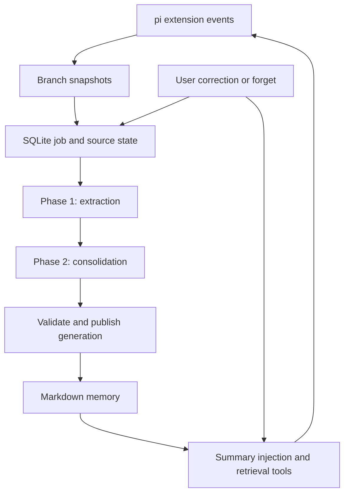

# Pi Memory — Implementation Specification

**Version:** 0.1.0  
**Date:** 2026-09-28  
**Status:** Proposed implementation contract, grounded in inspected upstream source  
**Working package name:** `pi-memory` — a local project name, not a claim that this npm name is available  
**Target:** A single-user TypeScript extension for pi with memory independent of Codex and Claude-mem

## 1. Purpose and agreed decisions

Build a persistent memory system for pi by porting the behavior of Codex CLI's open-source memory pipeline into TypeScript. The system must preserve useful user instructions, project decisions, decision rationale, failures, and unfinished work across sessions without requiring the user to repeatedly say “remember this.”

The user has explicitly selected:

- TypeScript implementation, rather than wrapping a Rust memory executable.
- Independent pi memory data, without sharing Codex's memory directory or database.
- Source-informed implementation using Codex's memory approach.
- A native pi extension as the integration surface.

This document specifies a new implementation. It does not claim that the implementation exists, that the user's installed pi matches the inspected version, or that matching the pipeline guarantees matching Codex's memory quality.

### 1.1 Scope

The v0.1 release includes automatic capture of participating pi sessions, two-stage LLM processing, file-based progressive retrieval, explicit correction and forgetting, background scheduling, durable job state, bounded model usage, diagnostics, and an evaluation harness.

There is no embedding model, vector database, reranker, HTTP memory server, Docker requirement, or independent resident daemon. SQLite stores coordination and provenance; Markdown stores model-readable memory. Online LLM calls use the configured pi provider runtime.

The first supported deployment is one user on Linux with a local filesystem. Cross-machine synchronization, shared team memory, full-text semantic search, automatic executable-skill generation, Codex v2 parity, and Claude-mem data migration are outside v0.1.

The existing `proletariat64/pi-bridge` remains a separate Claude-mem adapter. Its lifecycle and failure-isolation lessons are relevant, but this project does not change that repository's responsibilities or reuse its worker protocol.

## 2. Inspected source baseline

All upstream descriptions below refer to these exact commits, not an unspecified moving `main` branch.

| Source | Inspected revision | Relevant result |
|---|---|---|
| `earendil-works/pi` | `6f7551516b84278eb9da1c340c8e7bc66be1a6ba` | `@earendil-works/pi-coding-agent` package version 0.87.1; Node requirement >=22.19.0 |
| `openai/codex` | `1cc7e2361237ce7244430ee1d581c77f95c57ac8` | Both memory v1 and v2 are implemented; configuration defaults to v1 |

The source manifest in the implementation MUST record upstream repository, commit, path, content hash, local destination, and a description of every adaptation. The first implementation MUST vendor the relevant prompt templates at these revisions and retain upstream license notices.

### 2.1 Important findings

1. Codex v1 extracts `raw_memory`, `rollout_summary`, and `rollout_slug`; consolidation produces `MEMORY.md`, `memory_summary.md`, and optionally memory skills. It does not require vector retrieval. [C1–C5]
2. Codex v2 omits `raw_memory` and consolidates summaries into a compact `memory_summary.md`. It is a distinct selectable pipeline, not the default at the inspected commit. v0.1 of this project targets v1. [C2, C3, C6]
3. Codex starts memory work asynchronously for eligible root sessions, extracts sufficiently idle previous sessions, and coordinates work in a state database. Consolidation has one global lease and uses workspace changes as its dirty check. [C4, C5, C7]
4. pi extensions are TypeScript modules loaded into the pi process. Factories should register handlers, not start long-lived resources. `session_start` and `session_shutdown` bound the runtime. [P1, P2]
5. `agent_end` is not final settlement: retries, compaction, and queued work can follow. `agent_settled` is the final notification boundary in the inspected pi API. [P1, P2]
6. pi session files contain a tree. `getBranch()` follows the active ancestry; `buildSessionProjection()` returns the compacted model view, which can omit older raw evidence. Neither “all JSONL rows” nor “current model messages only” is a correct long-term-memory input by itself. [P3, P4]
7. pi's `loadEntriesFromFile()` can append a missing trailing newline. A historical importer requiring read-only behavior must not blindly call this helper on source files. [P4]
8. Some Codex README paths lag the code: orchestration is currently in `memories/write/src/`, and read prompts are in `ext/memories/templates/`. Code and tests take precedence over that README. [C1, C4, C8]

### 2.2 Codex v1 versus v2

Both versions use asynchronous extraction and consolidation; neither requires a local embedding model or vector database. The main difference is the number of retained learning layers and the route used to recover detail.

| Aspect | Codex v1 | Codex v2 |
|---|---|---|
| Per-session extraction | `raw_memory`, `rollout_summary`, and slug | `rollout_summary` and slug; no `raw_memory` |
| Per-session evidence | Detailed rollout summaries plus raw learning notes | Rollout summaries, truncated to 9,000 UTF-8 bytes by the parser |
| Consolidated output | Short summary, detailed `MEMORY.md`, optional skills | Compact `memory_summary.md`; no generated handbook/skills layer in the v2 output contract |
| Typical detail route | Injected summary → handbook → relevant rollout summary | Injected summary → relevant rollout summary directly |
| Compact-summary size | No equivalent v2 hard cap in v1's artifact validator | Must be strictly below 10,000 UTF-8 bytes |
| Source-input selection | Legacy rollout serialization | Prioritized evidence tiers; prefer user evidence over bulky tools under the input budget |
| Artifact root | `memories/` | Separate `memories_v2/` |
| Default at inspected revision | Yes | Explicit selection required |

The v2 summary cap is not a cap on the entire store: individual rollout summaries remain available for retrieval. Its writer prompt explicitly emphasizes scope, provenance, corrections, and avoiding the promotion of one-task requests into universal user preferences. Those concerns also matter to a v1 adaptation; they are not capabilities inherently unavailable to v1.

The likely tradeoff is a richer consolidated handbook in v1 versus fewer intermediate representations and more direct evidence retrieval in v2. Reduced duplication or better recall is an inference to test, not an established benchmark result. Neither version is automatically better for this user.

This spec provisionally selects the v1 output structure because a consolidated record of decisions, rationale, and failure lessons is a stated goal. This is the specification author's proposed baseline, not a user instruction to reject v2. Keep capture, scheduling, model access, and provenance independent of output format so a later v2-style profile can be evaluated without rebuilding the integration. A second profile is not required for v0.1. [C2, C3, C5, C6, C10]

### 2.3 Compatibility contract

The initial supported host is pi 0.87.1 at the inspected API level, running on Node >=22.19.0 with `node:sqlite` available. The implementation must capability-check `agent_settled`, structured system-prompt sections, branch access, and model-runtime access. Unsupported versions disable the extension's memory behavior with one diagnostic; they must not silently use older event semantics.

Declare pi-provided packages as peer dependencies with `*`, as pi packaging documentation requires; enforce the actual tested host range separately in runtime checks and release documentation. Do not bundle a second copy of pi's registries or classes. [P5]

## 3. Requirements

“MUST” is required for v0.1 acceptance. “SHOULD” allows a documented exception. Proposed defaults are design choices unless explicitly labeled as upstream defaults.

| ID | Requirement |
|---|---|
| R01 | Capture durable discussion and decisions even when a session makes zero tool calls. |
| R02 | Preserve who said what, scope, rationale, rejected options, acceptance status, and uncertainty. |
| R03 | Never promote an unaccepted assistant proposal to a user decision or universal preference. |
| R04 | Read existing memory without a model call on the user-prompt path. |
| R05 | Perform extraction and consolidation automatically, with bounded delay and usage. |
| R06 | Preserve branch, fork, checkout, and session identities; avoid importing abandoned alternatives as the current decision. |
| R07 | Never modify pi's source session files or Codex/Claude-mem data. |
| R08 | Publish a validated memory generation atomically; readers never mix generations. |
| R09 | Survive process exit, crashes, concurrent pi instances, provider failure, and schema errors. |
| R10 | Exclude the extension's own injected memory and internal consolidation conversations from capture. |
| R11 | Expose status, inspection, explicit run, correction, forgetting, and read-only diagnostics. |
| R12 | Demonstrate useful recall with grounded answers and fewer repeated user corrections, not just successful writes. |

## 4. Architecture



Components:

- **Pi adapter:** registers events, tools, commands, status UI, and the namespaced prompt section.
- **Capture adapter:** projects a selected session branch into sanitized, provenance-labeled evidence.
- **Coordinator:** handles activity state, eligibility, durable jobs, leases, budgets, and cancellation.
- **Model port:** accesses models through pi's registry without copying credentials or changing the foreground model.
- **Extractor:** performs a tool-free structured-output request for each eligible source revision.
- **Consolidator:** runs an isolated in-memory pi agent-core instance with only memory-workspace tools.
- **Publisher:** validates a staging workspace and makes one immutable generation current.
- **Reader:** injects a bounded summary and serves literal search/read/list operations.
- **Evaluator:** measures memory behavior against fixtures with evidence-based answer keys.

The background runner is an asynchronous task owned by the extension runtime. It has no independent network listener, persistent child process, filesystem watcher, or recurring source scan. Timers exist only for scheduled eligibility, retry deadlines, and lease/activity heartbeats while work is active. When all participating pi processes are closed, no memory processing runs; durable pending work resumes in the next eligible pi runtime.

## 5. Memory scope and identity

### 5.1 Independent user-level store

Use `<pi-agent-dir>/memory/`, where the agent directory is resolved through pi's `getAgentDir()` behavior, including `PI_CODING_AGENT_DIR`. [P9]

This is one user's pi memory across participating workspaces. “Independent” means independent of Codex and Claude-mem; it does not mean one isolated database per repository. Project boundaries are recorded in memory metadata and `applies_to` sections, matching the intent of Codex v1's scope-aware handbook.

Never discover or import `~/.codex/memories`, `~/.codex/sessions`, or Claude-mem databases automatically. A configuration pointing the memory root into those locations must be rejected.

### 5.2 Workspace identity

For Git workspaces, record `realpath(cwd)`, repository top-level, absolute Git common directory, checkout root, branch name, and HEAD when available. Use argv-based Git execution, a short timeout, and no shell interpolation. Do not require a remote URL.

- `repoKey = sha256(realpath(gitCommonDir))`.
- `checkoutKey = sha256(realpath(gitTopLevel))`.
- Non-Git: `workspaceKey = sha256(realpath(cwd))`.
- Separate clones stay separate. Worktrees share `repoKey` but retain distinct `checkoutKey` and applicability.
- Moving a repository does not silently merge it with another identity. A later explicit alias/migration feature can do so.

These are local routing identities, not claims about remote ownership. When Git metadata is unavailable, retain cwd identity and report the limitation.

### 5.3 Session and branch identity

- `sessionKey = sha256(agentDir + canonicalSessionPath + header.id)`.
- In-memory sessions have no durable capture by default; status shows `ephemeral`.
- A `branchId` is extension-owned and persists across forward progress on an ancestry chain.
- `lineageKey = sha256(sessionKey + ":" + branchId)` identifies the branch across revisions; each immutable revision has its own `sourceId`. Commands receiving a source ID resolve it to this lineage when their contract suppresses all revisions.
- Moving to an ancestor or sibling selects an existing compatible branch head or creates a new branch identity. Do not infer a branch from its textual topic.
- `revisionHash` covers normalized evidence, selected leaf, extraction-policy version, scope metadata, and applied context-edit state.
- Job uniqueness includes session, branch, revision, and prompt version.

On `session_tree`, conservatively deactivate previously selected heads for that session and invalidate their downstream generated memory until the new branch has a valid extraction. Historical decisions from an abandoned head must not silently guide its replacement. Resuming that old branch may reactivate it after validation.

Forks create a new session identity and preserve parent lineage. Shared ancestor evidence retains original source identifiers where determinable; it is not independent corroboration of a user preference. A copied/forked conversation must not turn one statement into repeated preference evidence.

## 6. Native pi extension contract

### 6.1 Lifecycle mapping

| pi event | Required memory action | Must not do |
|---|---|---|
| Extension factory | Register handlers, tools, commands, and flags | Start timers, model calls, or processes |
| `session_start` | Validate config; open state; restore identities; load published generation; register session activity; schedule eligible prior work | Await memory generation before pi becomes usable |
| `before_agent_start` | Mark foreground active; capture scope/model metadata; replace `systemPromptOptions.sections.pi_memory` with cached read guidance + summary | Call LLM; append repeated summary messages; replace the whole system prompt |
| `agent_start` | Mark this session busy; prevent new background requests from this runtime | Treat tool events as independent conversations |
| `agent_before_settle` | Record final outcome when supplied by the event; do not append continuation work | Return `continue: true` for memory processing |
| `agent_settled` | Capture an immutable snapshot from the authoritative branch; update activity time; schedule the due job | Assume `agent_end` was equivalent |
| `session_before_compact` | Checkpoint branch evidence with a bounded local operation | Replace or cancel pi compaction |
| `session_compact` | Refresh branch metadata; record that compaction occurred | Treat the compaction summary as new human evidence |
| `session_tree` | Reconcile active branch; invalidate obsolete branch-derived memory; reset reader pin | Combine both alternative histories |
| `session_shutdown` | Checkpoint if possible; abort owned background work; finish bounded local writes; release handles | Wait for an LLM to finish or keep a daemon running |

Use `session_start.reason` and `session_shutdown.reason` for reload, new, resume, and fork handling. Old contexts are invalid after replacement. Capture plain values for queued work, never retain an old `ctx` to mutate a new session. [P1, P2]

### 6.2 Prompt integration

Use the actual structured section API:

```typescript
pi.on("before_agent_start", async (event, ctx) => {
  const view = await reader.snapshotForTurn(ctx); // bounded local access only
  if (view.enabled) {
    event.systemPromptOptions.sections.pi_memory = view.instructions;
  } else {
    delete event.systemPromptOptions.sections.pi_memory;
  }
});
```

This is an API-shape example, not a complete implementation. Pi records system-prompt changes itself. The extractor excludes system messages, including this section, to avoid circular memory.

If another extension forces an opaque full system prompt, it can override section-based injection. Diagnose this as a compatibility limitation; do not overwrite the other extension's prompt or silently claim successful injection.

Pin a generation for one foreground run. A generation published mid-run becomes visible at the next `before_agent_start`. Tools called in that run use the same pin, except that an explicit forget or invalidation can revoke it immediately.

Before acquiring or serving a view, check the store's control epoch and source-retention eligibility, even when file content is cached. Schedule the earliest known retention deadline as a one-shot event. Expired evidence must not stay readable indefinitely just because no new session was extracted.

### 6.3 Runtime modes

Read/inject is supported in TUI, RPC, JSON, and print modes. Automatic capture is enabled by default only for TUI sessions. RPC/JSON/print capture requires an explicit `captureModes` configuration because pi subprocesses can represent delegated agents and the extension API does not provide a universal root-agent guarantee.

This is a deliberate limitation: mode is not proof of root identity. A cooperating launcher can set the extension flag `--pi-memory-mode off|read|read-write`; internal memory agents never load the extension at all. Status must show effective mode and why.

Use `ctx.hasUI` for supported dialogs, and `ctx.mode === "tui"` for terminal-specific rendering. No status text may be emitted into JSON protocol stdout. [P1]

## 7. Session capture and normalization

### 7.1 Live capture

Take a plain immutable copy of `ctx.sessionManager.getBranch()`, with session header/path, leaf, cwd, and source metadata. Retain ancestry from before compaction for extraction: the goal is learning from the conversation, not reproducing the current compacted model window.

Apply the latest branch-local `context_edit` to each target before exporting. A null replacement excludes the target from the new evidence. A replacement keeps source ID and role but substitutes content. This is a conservative privacy choice extending beyond the current model projection: pre-compaction raw text hidden by an applicable edit must not reappear through memory.

Store a sanitized evidence snapshot, not a second unfiltered transcript. Original pi session files remain authoritative and unchanged. Changes to the active projection supersede earlier snapshot revisions and trigger downstream invalidation when evidence was removed.

### 7.2 Evidence inclusion

| Input | Treatment |
|---|---|
| User text | Highest priority; retain decisions, reasons, constraints, corrections, and questions |
| Assistant visible text | Retain with assistant provenance; distinguish claims, proposals, and verified outcomes |
| Tool calls/results | Include bounded supporting evidence, errors, validation results, and relevant paths |
| Reasoning/thinking blocks | Exclude |
| Images/audio/binary | Replace with an explicit omitted-media marker; do not invent interpretation |
| System messages, loaded skills, injected context | Exclude |
| Own `pi_memory` metadata, retrieval outputs, consolidation messages | Exclude |
| Other extensions' custom messages | Exclude by default; future explicit adapters may label their provenance |
| Compaction/branch summaries | Treat as derived context only when raw evidence is unavailable, never as fresh user statements |
| Usage, model-change, labels | Keep needed metadata, not learning evidence |

Failed tools are eligible evidence. Tool success alone is not a memory-worthy fact.

Pi may persist programmatically submitted text as `role=user`. The format alone does not always prove human authorship. Preserve known origin metadata, label unknown origin honestly, and never assert that every user-role message was manually typed. This is an evaluation and integration limitation, not something to guess around.

### 7.3 Input budget and truncation

Default limits: 64 KiB per human/assistant text item; 8 KiB per tool result; 256 KiB normalized input per extraction. Preserve UTF-8 boundaries and explicit omission markers. Fit the rendered prompt into at most 70% of the model context after reserving output and instruction space; use a conservative byte-based upper estimate when no model tokenizer is available. Byte limits are not advertised as exact token counts.

If the input is too large, select user evidence first, then assistant conclusions, then supporting tool evidence; newest evidence wins within a tier, and selected items are rendered chronologically. Keep the adjacent question when a short answer such as “use option 1” depends on it. Record omitted entry IDs/counts in the local snapshot manifest. Never silently present a partial input as a complete transcript.

The priority-selection behavior is an explicit adaptation informed by Codex v2's tiered input builder, combined with the v1 output contract. It is not claimed to be byte-for-byte v1 parity. A compatibility fixture must detect loss of decision rationale at the boundary.

### 7.4 Historical import

Automatic processing only considers sessions enrolled by the extension. Initial installation does not bulk-upload every old session.

`/memory import <path> --dry-run` lists candidates, scope, total bytes, unsupported files, and branch ambiguity. `--run` explicitly enrolls the listed eligible sources. The importer is a strict, read-only JSONL v3 parser; a malformed interior line causes that file to be skipped with a diagnostic. A trailing incomplete record is deferred until stable. Unknown session versions are skipped, not migrated in place.

For a branching file with no captured active leaf, require `--leaf <entry-id>`; never equate the last physical JSONL line with the intended branch. A file with exactly one unambiguous terminal ancestry may be imported without a leaf argument. Imported sources use the same model budgets, filtering, deduplication, and provenance rules as live sources.

## 8. Phase 1: extraction

Input: immutable normalized evidence + source manifest + adapted v1 prompt. Output is exactly:

```typescript
interface ExtractionOutput {
  raw_memory: string;
  rollout_summary: string;
  rollout_slug: string;
}
```

The host generates IDs, timestamps, paths, and hashes. The model does not choose filesystem paths.

### 8.1 Content contract

For each substantive task, retain outcome (`success`, `partial`, `fail`, or `uncertain`), relevant user requests/corrections, important actions, validation evidence, open work, and scope.

A confirmed architecture decision should preserve:

- Chosen option and the user/evidence that establishes adoption.
- Reason and applicable constraints.
- Rejected alternatives and reasons, if supplied.
- Conditions that could reopen the decision.
- Remaining uncertainty and unfinished work.

Tentative discussion can remain in `rollout_summary` without promotion to durable `raw_memory`. Allow summary-only output as a documented pi adaptation. All-empty output is a successful no-op, and its revision is still marked processed.

User preference claims must distinguish an explicit general preference from a one-task request. Repetition across copied branches is not corroboration. Assistant assertions of successful completion require actual evidence or must remain uncertain.

### 8.2 Request and validation

Use `ctx.modelRegistry.find(provider, modelId)` and `ctx.modelRegistry.streamSimple(...).result()` through a captured model-port closure. Do not hardcode a provider HTTP endpoint or read credentials into memory files. [P6]

A fulfilled stream-result promise is not itself success: inspect the resulting message's stop/error state. Aborted or provider-error messages must enter cancellation/retry handling, not JSON repair as if they were valid assistant output.

Phase 1 has no tools. Where a provider supports structured-output enforcement through pi, use it; otherwise parse and validate JSON strictly. Strip at most one enclosing Markdown JSON fence. Reject extra prose, unknown keys, non-string fields, invalid UTF-8 boundaries, or oversize output. One bounded repair request may include schema errors and the prior output; it counts toward usage and attempts.

Default combined extraction-output limit is 48 KiB. Sanitize slug characters, cap at 80 characters, and prefix filenames with a host-generated unique source identifier; slug never supplies identity. Scan generated output for secrets again before persistence.

Store the source revision, prompt hash, selected model, request usage, output hash, and outcome. A late response from an obsolete revision or lost lease is discarded. It cannot overwrite a newer extraction.

## 9. Phase 2: consolidation

### 9.1 Selection

Claim one global consolidation lease before constructing a staging workspace. Select the newest valid extraction for each active branch lineage, excluding suppressed sources, invalidated branches, forgotten sources, and expired records.

Default selection follows Codex's inspected policy: up to 256 sources; eligible if their last real use, or source-update time when never used, falls within 30 days. Rank by `usageCount` descending, then last-use/source-update time descending, then stable source ID. Mechanically merge `raw_memories.md` in stable source-ID order, so usage ranking does not create text churn. [C7]

An injection of `memory_summary.md` is not a use of every source. Increment source usage only for a successful detail read or an explicitly validated memory citation; deduplicate by consumer session, foreground run, and source. Literal-search hits alone do not extend retention.

Retention removes generated learning, not the user's original sessions. An expired processed revision is not automatically regenerated on every startup; explicit reimport or new activity can make it eligible again.

### 9.2 Staging workspace

Create a private staging directory containing selected summaries, merged raw memories, prior valid outputs when allowed, active user notes, and `phase2_workspace_diff.md`.

Use a deterministic manifest and unified textual diff against the last successful generation. This replaces Codex's private Git-baseline implementation while preserving addition/modification/deletion semantics. Every deletion must be represented; do not silently truncate a diff. If a diff exceeds 4 MiB, provide a complete changed-path index and require per-file reads, recording that fallback in the job.

If selection hashes, prompt version, notes, invalidation epoch, and outputs are unchanged, skip the LLM. This dirty check is content-based, not merely timestamp-based.

### 9.3 Restricted consolidation agent

Use `Agent` from `@earendil-works/pi-agent-core`, with explicit model, system prompt, empty messages, a `streamFn` delegated to the captured model port, and sequential custom tools. [P7]

Do not call the default `createAgentSession()` factory, which would discover normal project resources. Do not load user/project extensions, project instructions, MCP tools, hooks, or memory into the consolidation runtime. It has no persisted pi session, so it cannot be captured recursively.

The only available tools are:

| Tool | Allowed operation |
|---|---|
| `workspace_list` | List staged relative paths |
| `workspace_read` | Read bounded line ranges of staged files |
| `workspace_search` | Literal search of staged UTF-8 text |
| `workspace_write` | Replace approved generated output files atomically within staging |
| `workspace_delete` | Delete optional generated procedure files within staging |

No shell, network-fetch tool, repository write, original transcript read, package installation, or recursive delegation is available. Model API transport still uses the network. This is tool-surface confinement, not an OS sandbox for arbitrary third-party extension code.

Reject absolute paths, `..`, symlinks, device files, and writes outside the output allowlist. Selected evidence and user notes are read-only. Tool descriptions must tell the agent these boundaries.

### 9.4 Output requirements

Required: `MEMORY.md`, `memory_summary.md`. Optional: `skills/<slug>/SKILL.md` containing prose-only procedures. No generated executable scripts, automatic installation into pi's skills directory, or implicit command execution in v0.1.

`MEMORY.md` uses task groups with `scope`, `applies_to`, task-local source references and keywords, followed by supported preferences, reusable knowledge, and failure lessons. Preserve exact safe identifiers, model/user wording, and decision conditions. Do not create one flat chronological log.

`memory_summary.md` starts with literal `v1` and contains, in order:

1. `## User Profile`
2. `## User preferences`
3. `## General Tips`
4. `## What's in Memory`

It is a compact routing and preference layer, not another full handbook. Default maximum: 10,000 UTF-8 bytes, with no mid-sentence slicing to make invalid output pass. This hard limit is a pi design choice informed by Codex v2, not a v1 default.

Use the conversation's language for substantive memory, preserve exact technical identifiers, and retain original-language evidence for quoted preferences. English structural headings are stable schema markers; Chinese content is supported.

Every task group must cite existing selected source files or explicit user-note IDs. Summary pointers must resolve to generated handbook sections or selected evidence. Claims whose only support was removed must be removed. Source-backed corrections outrank older summaries. No new claim can be justified solely by a previous generated claim.

### 9.5 Publication protocol

1. Build staging and snapshot its source-selection hash, control/invalidation epoch, base generation, and lease fencing token.
2. Run consolidation, or produce deterministic minimal required files when no sources/notes remain.
3. Validate required headings, UTF-8/size bounds, path safety, pointer existence, source eligibility, and secret scan. Structural validation does not prove semantic truth; the quality suite covers that separately.
4. Write `manifest.json` with file hashes and selected extraction IDs; fsync files and staging directory.
5. Rename staging to a unique immutable `generations/<generationId>/` on the same filesystem.
6. In one short SQLite transaction, verify lease token, expected base generation, selection state, and unchanged control epoch; mark the generation published and set `store_state.active_generation_id`.
7. Readers resolve only the DB-selected immutable generation. A failed CAS leaves an orphan directory that is never served and is later removed.

SQLite is the sole publication pointer. There is no second `current` symlink or JSON pointer to reconcile. A crash before the transaction leaves the previous generation current; a crash after it leaves a complete new generation current. Fsync/transaction tests must cover both boundaries.

Keep at most two old generations for ordinary recovery, plus any currently pinned reader generation. Invalidation/forget overrides recovery retention: no revoked generation can become current or be read through tools.

## 10. Read path and progressive disclosure

Normal prompt handling uses no memory-related LLM request. Inject the cached bounded summary, current workspace applicability, generation ID, and adapted read guidance in the `pi_memory` section. If storage is unavailable or invalidated, omit memory and continue the user task.

The section must label historical content as evidence, not instructions that override current user requests or higher-priority policy. Source text, generated memory, and user-note bodies must never be interpolated into tool definitions or trusted control instructions.

For relevant requests, the agent should search `MEMORY.md`, read the relevant task group, and open one or two cited rollout summaries only if needed. Self-contained requests can skip detail retrieval. Stop after a small unsuccessful search rather than browsing every historical source. Historical status is not proof of current repository behavior.

Register three read-only tools:

```typescript
type MemorySearchArgs = {
  queries: string[]; // 1..8 non-empty literal strings
  path?: string;    // relative within the pinned generation
  match: "any" | "all";
  caseSensitive?: boolean;
  maxResults?: number; // default 20, maximum 50
  cursor?: string;
};

type MemoryReadArgs = {
  path: string;
  startLine?: number; // 1-based
  maxLines?: number;  // default 120, maximum 300
};

type MemoryListArgs = { path?: string; cursor?: string; limit?: number };
```

Tool names: `pi_memory_search`, `pi_memory_read`, `pi_memory_list`. Tools resolve only the pinned generation, not source snapshots, the DB, arbitrary absolute paths, or another user's files. Default searchable paths are `MEMORY.md`, `rollout_summaries/`, and prose procedures. `raw_memories.md` and operational diffs are writer inputs, not normal reader targets.

Literal Unicode substring matching supports Chinese without an English-only tokenizer. Case folding applies only when requested; no silent transliteration. Sort by relative path and line for determinism. A cursor includes generation, query hash, and offset; reject a mismatched cursor. Cap each response at 16 KiB and expose `truncated` and continuation information.

Return generation ID, relative path, line numbers, source IDs when known, and content in tool `details` as well as readable text. Cite actual memory read evidence in ordinary Markdown only when relevant. Do not require Codex's proprietary citation wrapper, and do not reread files solely to construct citations.

The reader has no semantic ranking promise. If literal retrieval misses paraphrases, improve the summary's routing keywords and evaluate before adding new infrastructure.

## 11. Scheduling, resource use, and concurrency

### 11.1 Defaults and deviations

| Setting | Proposed pi default | Inspected Codex default/behavior |
|---|---:|---|
| Minimum source idle time | 6 hours | 6 hours |
| Maximum source age for automatic extraction | 10 days | 10 days |
| Extractions per scheduler pass | 2 | 2 per startup |
| Phase 1 concurrency | 2 | Internal cap of 8 |
| Consolidation input count | 256 | 256 |
| Unused-memory window | 30 days | 30 days |
| Global consolidators | 1 | 1 lease |
| Triggers | Startup, final settlement, due-time timer, explicit command | Startup pipeline |
| Quota control | Provider-neutral request/token budgets | Codex quota-window guard also exists |

Six hours means recent conversations may not be available in memory immediately. This is intentional stabilization, not failed capture. `/memory run --now` can process a settled snapshot without waiting. `minIdleMinutes` is configurable; reducing it increases model work and the chance of learning an intermediate conclusion.

### 11.2 Eligibility

A source revision is eligible only when it is enrolled, persistent, permitted by effective mode, stable on its selected branch, not suppressed, not processed for this prompt version, within age/budget limits, and idle for the configured interval. No participating process may report the source session as busy. A currently settled session may become eligible after the full idle interval.

At session startup and each final settlement, schedule bounded work. Use one-shot due-time timers; do not scan on a repeating interval. After a completed pass, schedule another pass only if known eligible backlog and remaining budgets exist. Timers are unreferenced so they do not keep pi alive.

While a foreground run is active, renew its process-activity record every 30 seconds with a 180-second expiry. This is coordination, not a source scan. A stale activity record can be retired after expiry, but jobs must still validate their captured revision and fencing token before committing. Normal shutdown removes the owned record.

The same process starts new model requests only while its foreground session is idle. If a user begins work while one request is in flight, allow that request to complete under its budget, but pause subsequent requests until settlement. Shutdown/reload cancels it. Cross-process model contention is bounded by store-wide slots, not by holding a SQLite transaction open during network IO.

### 11.3 Leases and exactly-once effects

SQLite uses WAL, foreign keys, a bounded busy timeout, and short transactions. Lease claims are compare-and-swap updates with random owner ID and monotonically increasing fencing token. Lease TTL defaults to 180 seconds; renew every 30 seconds while work is active. If renewal fails or ownership is lost, abort and reject subsequent writes.

Jobs may execute more than once after a crash. Accepted results and publication must be idempotent and fenced. Do not claim exactly-once provider billing: a timed-out request may have been charged even when its response was lost.

Retry transient network/429/5xx failures with scheduled backoff (1 minute, 5 minutes, 30 minutes), honoring larger provider retry hints. Maximum three network attempts per revision per configuration epoch. Authentication/model-not-found errors become `blocked`, with no automatic hot retry. JSON repair is at most once per attempt and counts toward budgets. Cancellation does not count as a schema/model failure.

### 11.4 Usage budgets

Default automatic budget per local calendar day: 100,000 input-token units and 20,000 output-token units, at most 20 model requests across both phases. These are proposed starter limits, not price estimates. Count consolidation's repeated context input on every call.

Reserve capacity transactionally before starting each call, using actual tokenizer count when available and otherwise a conservative byte-based estimate; reconcile against provider usage after completion. Missing usage keeps the reservation as the conservative charge. If a request cannot fit, defer it and report the reason. `/memory run` obeys the same budget unless the user supplies an explicit one-run override.

Phase 1: 120-second call timeout, 6,000 output-token cap subject to model limits. Phase 2: 5-minute total timeout, at most 12 model calls and 40 workspace-tool calls, 4,000 output tokens per call. Budget exhaustion discards unpublished staging and preserves last valid memory.

Before every consolidation request, account for its full accumulated messages, tool definitions, and reserved output against the selected model's context limit. Bound tool results and provide pagination. If the next request will not fit, stop with `context_budget`; do not silently drop earlier user corrections or source-deletion instructions. Automatic context summarization inside the writer is outside v0.1.

## 12. Persistence contracts

### 12.1 Files

| Path beneath memory root | Owner and meaning |
|---|---|
| `state.sqlite` plus WAL/SHM | State store; never user-edit as configuration |
| `config.json` | User-owned versioned extension configuration |
| `sources/<lineage-key>/<revision>.json` | Sanitized immutable extraction snapshot and source metadata |
| `generations/<id>/memory_summary.md` | Published compact context |
| `generations/<id>/MEMORY.md` | Published handbook |
| `generations/<id>/rollout_summaries/*.md` | Selected extraction evidence |
| `generations/<id>/skills/*/SKILL.md` | Optional prose-only procedures |
| `generations/<id>/raw_memories.md` | Mechanically assembled writer input |
| `generations/<id>/manifest.json` | File hashes, source IDs, prompt version, schema version |
| `staging/<job-id>/` | Unpublished work; removable after expired ownership |
| `notes/<note-id>.md` | Explicit user additions/corrections, with metadata in SQLite |
| `logs/events.jsonl` | Rotated metadata-only operational log |

No API key, provider auth file, unrestricted raw tool dump, or internal model reasoning belongs in this tree. Directory mode is 0700 and file mode 0600 where supported. Filesystem permissions are not encryption.

### 12.2 SQLite logical schema

All timestamps are integer UTC milliseconds. IDs are host-generated strings. JSON fields use explicit schema versions and validation. Migrations are transactional and monotonic.

| Table | Essential columns and constraints |
|---|---|
| `schema_migrations` | `version` PK, `applied_at` |
| `store_state` | singleton PK, `active_generation_id`, `control_epoch`, `read_blocked`, `block_reason` |
| `workspaces` | `workspace_key` PK, `repo_key`, `checkout_key`, `cwd`, `git_branch`, `git_head`, `updated_at` |
| `sessions` | `session_key` PK, path, header ID, parent key, workspace key, enrollment time, active branch, mode, last activity |
| `branch_heads` | PK `(session_key, branch_id)`, selected leaf, latest revision, state `active/retired/suppressed` |
| `source_revisions` | `source_id` PK; `lineage_key`; session/branch/revision UNIQUE; snapshot path/hash; leaf; source time; status; extraction-policy hash |
| `jobs` | `job_id` PK; kind `extract/consolidate`; unique work key; status; attempt count; due time; owner; fence; lease expiry; error code |
| `extractions` | `extraction_id` PK; source/prompt hash UNIQUE; three output strings; model ref; output hash; outcome; usage; timestamps |
| `memory_usage` | PK `(consumer_session, run_id, source_id)`; successful detail-read time |
| `source_stats` | `lineage_key` PK; usage count; last used; processed/retention watermark |
| `notes` | note ID PK; action; text path/hash; scope; creation; latest applied generation; active/superseded |
| `tombstones` | target kind/key UNIQUE; creation; reason category; no deleted plaintext |
| `generations` | generation ID PK; status; base ID; input hash; directory; manifest hash; control epoch; created/published timestamps |
| `generation_sources` | PK `(generation_id, extraction_id)` |
| `process_activity` | owner ID PK; session key; activity state; heartbeat expiry |
| `budget_usage` | PK `(local_day, provider, model)`; reserved/actual input/output; call count |

Use explicit foreign keys where rows have a stable lifetime; avoid cascades that accidentally delete user notes or tombstones. Extracted content may reside in SQLite and published Markdown; deletion must address both copies.

### 12.3 Job states

`queued → leased → succeeded | no_output | retry_wait | blocked | cancelled | superseded`.

An expired lease can return to `queued`. `superseded` means evidence changed while work was in progress. `blocked` requires changed configuration or an explicit retry. A successful no-output job remains processed so it does not repeat every startup.

### 12.4 Core interfaces

```typescript
interface ModelRef { provider: string; modelId: string }

interface SourceSnapshot {
  schemaVersion: 1;
  sourceId: string;
  lineageKey: string;
  sessionKey: string;
  branchId: string;
  leafId: string;
  revisionHash: string;
  workspaceKey: string;
  capturedAt: number;
  sourceUpdatedAt: number;
  evidence: EvidenceItem[];
  omissions: { count: number; reasons: string[] };
}

interface EvidenceItem {
  entryId: string;
  role: "user" | "assistant" | "tool" | "derived";
  origin: "human_observed" | "programmatic" | "unknown";
  timestamp: number;
  text: string;
  toolCallId?: string;
  isError?: boolean;
}

interface MemoryModelPort {
  resolve(ref: ModelRef): ResolvedMemoryModel;
  stream: import("@earendil-works/pi-agent-core").StreamFn;
}

interface MemoryStore {
  enqueue(snapshot: SourceSnapshot): Promise<void>;
  claimEligible(owner: string, now: number): Promise<LeasedJob[]>;
  commitExtraction(job: LeasedJob, output: ExtractionOutput): Promise<boolean>;
  publish(candidate: ValidatedGeneration, fence: number): Promise<boolean>;
  acquireReadView(): Promise<MemoryReadView | undefined>;
}
```

Names such as `ResolvedMemoryModel` are project-owned contracts to be concretized during implementation, not claimed pi exports. Exact pi declarations must be imported from the pinned peer APIs.

## 13. Model configuration and credentials

Extraction and consolidation models are configured independently. On first eligible foreground prompt, if unset, resolve and persist the current pi provider/model as both defaults. Subsequent foreground model switches do not silently change memory model cost or behavior. Users can change each memory model through `/memory model`.

If no model is available, continue read-only memory and show generation as blocked. Never silently switch provider or use a different account.

Use pi's request-time auth and provider resolution. This supports the provider mechanisms actually configured in pi, including custom providers, without reimplementing OAuth or copying tokens. A provider must successfully complete the tool-free JSON probe for extraction and the tool-use probe for consolidation before being considered compatible.

A DeepSeek model may be selected if available through the user's pi configuration and it passes those probes. This spec does not prescribe a model name, claim a price, or promise equal quality across providers.

Use a captured registry/model-port reference only while its owning runtime is valid. Abort all owned memory agents during reload/shutdown; a new runtime resolves fresh references and resumes durable jobs.

## 14. Configuration

Illustrative complete configuration, with user-selected model references initially null:

```json
{
  "schemaVersion": 1,
  "enabled": true,
  "read": true,
  "generate": true,
  "captureModes": ["tui"],
  "excludedWorkspaces": [],
  "models": { "extract": null, "consolidate": null },
  "schedule": {
    "minIdleMinutes": 360,
    "maxSourceAgeDays": 10,
    "maxExtractionsPerPass": 2,
    "extractionConcurrency": 2,
    "maxConsolidationSources": 256,
    "maxUnusedDays": 30
  },
  "limits": {
    "inputBytes": 262144,
    "toolResultBytes": 8192,
    "extractionOutputBytes": 49152,
    "summaryBytes": 10000,
    "toolResponseBytes": 16384,
    "dailyInputTokens": 100000,
    "dailyOutputTokens": 20000,
    "dailyRequests": 20,
    "maxStoreBytes": 209715200
  },
  "timezone": "Asia/Shanghai"
}
```

Timezone controls daily budgets and human-facing dates, not storage timestamps. The initial value comes from the host's configured local timezone; the example matches the user's current timezone.

Configuration precedence: explicit extension CLI flag > user configuration > defaults. v0.1 does not load memory policy from repository-controlled files. Reject unknown schema versions and invalid ranges; preserve the file and disable generation rather than overwrite it. Distinguish `enabled=false` from `generate=false, read=true`.

`excludedWorkspaces` applies to both capture and reading: no summary injection or retrieval tools may disclose stored memory while the active cwd is excluded. Canonicalize configured paths and enforce directory-boundary containment rather than string-prefix matching. Excluding a workspace does not itself delete previously captured evidence; use explicit forget for that purpose.

When the store reaches its size cap, prune obsolete unreferenced staging and generations first. Never delete active notes/tombstones, pinned generations, or original sessions to meet the cap. If still full, pause capture/generation with `storage_limit`; reads of valid memory continue. Sanitized source snapshots can be deleted after successful extraction and a seven-day recovery window, provided no job needs them; the original source pointer remains.

## 15. User-facing commands and tools

Use one `/memory` command with subcommands. Outputs should explain the relevant state rather than dump internal JSON; `--json` is available for diagnostics and automation.

| Command | Contract |
|---|---|
| `/memory status` | Effective mode/model, active generation, captured vs extracted vs published counts, next due time, budget, last error |
| `/memory doctor` | Read-only checks of host API, paths, schema, file/DB consistency, configuration, model resolution; no paid calls |
| `/memory test-models` | Explicit bounded paid JSON/tool-use compatibility probes; report actual usage |
| `/memory inspect` | View summary and source routing; optionally select a source or generation |
| `/memory run [--now]` | Queue a bounded pass; `--now` skips idle delay for a settled snapshot only |
| `/memory model extract|consolidate <provider>/<model>` | Validate and persist a model selection |
| `/memory mode off|read|read-write` | Set durable mode without deleting data |
| `/memory import <path> --dry-run|--run [--leaf ID]` | Historical import per Section 7.4 |
| `/memory remember <text>` | Add a scoped explicit note and schedule consolidation |
| `/memory correct <text>` | Add a correction note; invalidate old generated guidance until reconciled |
| `/memory forget source <source-id>` | Suppress all revisions of a source lineage and invalidate derived memory |
| `/memory forget session <session-key>` | Suppress all branches/revisions of that session |
| `/memory forget note <note-id>` | Remove an explicit note and rebuild; independently supported source evidence remains eligible |
| `/memory clear --confirm` | Remove this extension's generated memory/state as documented; never delete original pi sessions |

Explicit note input is processed as user evidence. Remembering is optional; ordinary capture remains automatic. Notes persist until explicitly superseded/removed, so an old raw summary cannot resurrect a corrected rule.

Forgetting a note removes that evidence item, not every occurrence of its subject across sessions. Removing a correction may make older independently supported evidence applicable again; the command must explain this consequence. Use a replacement correction or forget the supporting source lineages when that is the intended result.

To support natural-language explicit “remember/correct” requests, a fourth model-callable tool `pi_memory_note` accepts `{action: "remember" | "correct", text, scope}`. Its description restricts use to the user's explicit request. It records the triggering run and user-message pointer when available. It has no general delete capability; deterministic forget commands require concrete source IDs. This is an agent behavior contract, not a guarantee that arbitrary malicious tool callers obey it.

No general-purpose standalone CLI is required for v0.1. All core logic remains UI-independent so a future CLI can call the same coordinator.

## 16. Correction, deletion, and privacy semantics

On source deletion, branch invalidation, context-edit removal, or a user correction/forget:

1. Commit a new `control_epoch` and block affected generated memory from being served. v0.1 may conservatively block the entire generated view.
2. Revoke in-memory reader pins at the next tool/prompt boundary. The currently in-flight model request cannot be recalled.
3. For explicit forget, record durable suppression/tombstones before deleting outputs; they prevent startup reimport of the same source lineage. Branch changes instead retire the old head without permanently suppressing it. Context edits invalidate affected revisions; corrections add active correction notes. These temporary changes must not accidentally create permanent source-wide forget tombstones.
4. Rebuild from remaining eligible evidence and active correction notes. For deletion, do not give the consolidator the old potentially contaminated outputs.
5. Publish a clean generation; unblock reading only after successful validation.
6. Remove revoked generations and affected staging. Explicit forget or privacy-related context removal also removes affected snapshots/extractions in the extension store, retaining minimal tombstones without deleted text. Ordinary branch retirement may keep historical evidence at rest for later validated reactivation, but cannot serve it through memory tools while retired.

Failure to rebuild leaves memory temporarily unavailable, not stale. Ordinary expiry uses the same invalidation principle; a failing provider must not indefinitely keep expired guidance eligible.

Deleting memory does not delete pi's original transcript, backups outside this extension, or content already sent to a model provider. State this in command results when relevant. Semantic requests such as “forget everything about X” require selecting concrete sources or submitting a correction; v0.1 does not promise exact semantic erasure by keyword.

Redact obvious credentials and signed/access-bearing URL values before extraction, after extraction, and before publication. Preserve safe references. Test redaction, but do not claim perfect secret detection. Raw source files are never printed in routine logs.

Disabling or uninstalling this package leaves its data intact. `/memory clear` explicitly removes its store and sets generation off before cleanup so it does not immediately recreate memory. Re-enabling capture is a separate user action.

## 17. Error and recovery behavior

| Failure | Required response |
|---|---|
| No model/auth or incompatible provider | Continue normal pi; valid memory reads remain available; show blocked generation |
| Offline/rate limit | Schedule retry under budget; do not block prompt submission |
| Extraction JSON invalid | One bounded repair, then retry/blocked with exact validation reason |
| Consolidation incomplete/invalid | Discard staging; retain previous valid generation unless revoked |
| Process killed during write | Recover lease; ignore uncommitted generation; retry safely |
| Two pi instances consolidate | One winner via global lease + publication CAS; loser never publishes |
| Evidence changes mid-request | Reject stale output or stage for a still-valid historical branch only; never mark it current |
| Memory DB locked beyond timeout | Skip operation, surface diagnostic, continue pi |
| DB corruption | Disable memory; preserve files for recovery; never auto-delete and recreate |
| Disk full | Pause writes; preserve active generation and show storage error |
| Session switch/reload | Cancel owned jobs; discard old context references; resume under new runtime |
| pi API mismatch | Disable extension behavior with actionable minimum-version diagnostic |
| Missing original transcript | Retain already extracted memory with unavailable-source marker unless user forgot it; do not infer a deletion request |

`source file missing` is different from an explicit forget. Retention and suppression must not be inferred from transient filesystem availability.

## 18. Observability and performance

Record metadata for capture, skipped eligibility, claimed jobs, provider requests, retries, no-output results, validation failures, generation commits, retrieval, and invalidation. Each event includes IDs, duration, bytes, model reference, token/cost data if supplied, and error code. No prompt bodies, credentials, or full tool results in normal logs.

Status distinguishes `captured`, `pending idle window`, `extracting`, `extracted`, `consolidating`, `published`, `blocked`, and `read invalidated`. “Memory enabled” alone is insufficient evidence that useful data was written or injected.

Proposed performance gates on a 2-vCPU, 4-GB Linux host with local SSD and 256 selected sources:

- Cached prompt-section preparation: p95 <20 ms; no network.
- Bounded state/view refresh: p95 <100 ms; fail open after 200 ms.
- Search/read: p95 <250 ms within the configured 16-KiB output budget.
- Checkpoint hooks: target <100 ms and yield for large sessions; never run synchronous full-history serialization in a tool or provider-stream event.
- Shutdown-owned work: complete local cleanup/abort within 500 ms; jobs remain recoverable if cleanup is interrupted.
- Additional steady-state memory target: <100 MiB over the same pi run without the extension; no loaded ML weights.

These are acceptance targets, not measured claims. Use bounded SQLite operations; move expensive parsing/serialization to asynchronous chunks or a worker thread if profiling shows event-loop stalls. A worker thread must not own a separate model/provider registry.

## 19. Acceptance and quality evaluation

### 19.1 Required behavioral tests

| ID | Scenario | Passing result |
|---|---|---|
| T01 | Pure discussion adopts TS over Rust | Later session recalls choice and reason with evidence; no tool call required |
| T02 | Assistant proposes A; user chooses B | B is adopted; A remains rejected/proposed, not a user preference |
| T03 | User changes a decision later | New decision controls; previous rationale retains superseded status |
| T04 | User says “plan first” for one task | No universal approval-before-every-edit rule is invented |
| T05 | Many routine tool calls, few decisions | Important decision survives; routine tool logs do not dominate summary |
| T06 | Chinese discussion and identifiers | Chinese rationale and exact technical identifiers remain retrievable |
| T07 | Current-context compaction | Earlier raw decision evidence remains eligible without double-counting compaction summary |
| T08 | `/tree` switches alternatives | Abandoned branch cannot silently supply the replacement branch's current decision |
| T09 | `/fork`, reload, resume | Correct identities; shared ancestors do not count as repeated human preference |
| T10 | Context edit removes sensitive content | New evidence excludes it; previously derived view is invalidated |
| T11 | Provider retry after `agent_end` | Only final settled snapshot is treated as the completed run |
| T12 | No reusable signal | No-output result stored once; no repeated extraction churn |
| T13 | Parallel pi processes | One accepted extraction per revision and one published consolidation winner |
| T14 | Crash at each publication boundary | Readers see complete old or complete new generation, never a mixture |
| T15 | Memory tool output appears in session | It is excluded from future extraction; no self-reinforcement loop |
| T16 | Correction/forget then provider outage | Revoked memory is unavailable; it is not served because rebuild failed |
| T17 | Provider credentials rotate or model disappears | Resolve through pi; no copied token; no silent provider fallback |
| T18 | Hostile transcript asks writer to run shell | Writer has no shell/network-fetch tool and cannot escape staging paths |
| T19 | Budget exhausted | No next request starts; foreground pi remains usable |
| T20 | Malformed or branching historic JSONL | No file modification; reject ambiguity or require explicit leaf |
| T21 | Another extension forces system prompt | Diagnose section-injection conflict; do not silently override it |
| T22 | Disabled or ephemeral mode | No capture/model generation and no unintended persistent artifacts |

Use deterministic fake model responses for state-machine and crash tests. These tests do not establish memory quality; use real models for the next gate.

### 19.2 Semantic evaluation

Create at least 30 self-contained multi-session cases: 10 decisions/rationale, 5 scoped preferences, 5 failures/open work, 5 corrections/branch conflicts, and 5 noise/abstention cases. At least 10 contain Chinese or mixed-language discussion, and at least 5 contain no tool calls. Each case includes expected facts, prohibited claims, evidence pointers, and query intent.

Compare three modes using the same answering model and query prompts:

1. No cross-session memory.
2. A manually curated compact summary baseline.
3. This implementation's generated memory.

Run three repetitions per case, record model IDs/prompt hashes and costs, and review ambiguous scores manually. Release targets:

- >=90% correct adopted decision + rationale on the decision cases.
- Zero critical invented approval, reversed decision, wrong-project action, or forgotten-source disclosure in the required fixtures.
- >=90% correct abstention when evidence is missing or tentative.
- No more than 5 percentage points worse than the curated-summary baseline on overall grounded answer success, with materially less manual curation.
- Demonstrate that discussion-only capture works in actual generated memory, not just parser unit tests.

Scores are go/no-go engineering targets for these fixtures, not public claims about general intelligence or LongMemEval performance. Failure should lead to diagnosis of capture, consolidation, routing, or agent use before adding a new search backend.

### 19.3 Ready-to-release gate

All T01–T22 pass; actual pi TUI and one read-only noninteractive path are exercised; crash/concurrency tests pass; semantic targets are met; no credentials appear in generated/log fixtures; installation/removal preserves unrelated pi settings; source/prompt provenance and licenses are included.

## 20. Implementation organization

Suggested modules:

| Module | Responsibility |
|---|---|
| `src/extension.ts` | Registration and lifecycle adapter |
| `src/pi/compat.ts` | Version/capability checks and pinned host API boundary |
| `src/pi/model-port.ts` | Registry-backed streaming, model resolution, usage |
| `src/capture/branch.ts` | Branch ancestry, context edits, fork provenance |
| `src/capture/normalize.ts` | Evidence filtering, redaction, budgets |
| `src/capture/import.ts` | Read-only historical parser |
| `src/state/db.ts`, `migrations/` | SQLite schema, transactions, leases, fencing |
| `src/pipeline/scheduler.ts` | Eligibility, one-shot scheduling, budgets |
| `src/pipeline/extract.ts` | Phase 1 request and validation |
| `src/pipeline/consolidate.ts` | Restricted agent-core loop and tools |
| `src/pipeline/publish.ts` | Staging validation, fsync, generation CAS |
| `src/read/` | Prompt section, search/read/list, generation pins |
| `src/control/` | Notes, correction, forgetting, invalidation |
| `src/commands/` | `/memory` interface and diagnostics |
| `prompts/upstream/` | Immutable pinned Codex source templates |
| `prompts/pi/` | Explicitly adapted templates and rendering |
| `eval/` | Fixtures, expected evidence, runner and score reports |
| `UPSTREAM.md`, `NOTICE`, `LICENSE` | Provenance and attribution |

Use ESM and pi's TypeScript loader. Runtime dependencies should remain small: pi-provided peer packages, `node:sqlite`, Node filesystem/crypto, TypeBox, and at most a maintained text-diff implementation. No provider SDK should be added merely to bypass pi's existing model runtime.

Package manifest example:

```json
{
  "name": "pi-memory",
  "version": "0.1.0",
  "type": "module",
  "keywords": ["pi-package"],
  "engines": { "node": ">=22.19.0" },
  "pi": { "extensions": ["./src/extension.ts"] },
  "peerDependencies": {
    "@earendil-works/pi-coding-agent": "*",
    "@earendil-works/pi-agent-core": "*",
    "@earendil-works/pi-ai": "*",
    "typebox": "*"
  }
}
```

Local installation for the developed package is `pi install ./pi-memory`; restart or reload pi using the host's normal mechanisms. No repository URL or npm publication is assumed by this spec. Bun/compiled-binary pi support requires separate testing and is not a v0.1 promise.

## 21. Delivery sequence

1. **Source and compatibility baseline:** pin sources, record licenses/adaptations, establish host API tests, implement read-only normalized session fixtures. Exit: branch/compaction/context-edit fixtures are correct.
2. **Durable capture and Phase 1:** implement state, leases, model port, budgets, output validation, no-output behavior. Exit: discussion-only extraction and restart tests pass.
3. **Consolidation and publication:** add confined tools, workspace diff, schemas, atomic generation commit, recovery. Exit: crash/concurrency tests pass.
4. **Read path and controls:** add bounded section injection, read tools, explicit notes, invalidation/forget, status/doctor. Exit: no prompt-path network calls and no revoked-memory readback.
5. **Quality gate and packaging:** run real-model comparisons, resolve failing categories, document measured footprint and model configuration, package for pi installation.

Do not implement synchronization or additional memory backends before the semantic gate establishes value. No change to `pi-bridge` or a new GitHub repository is implied by this document alone.

## 22. Upstream reuse and explicit departures

| Element | Decision |
|---|---|
| Rust memory runtime | Reimplement behavior in TS; no runtime dependency on Codex binary |
| v1 extraction/consolidation/read prompts | Vendor pinned originals, adapt names/APIs with a reviewed change log |
| v1 schemas and progressive disclosure | Preserve core structure |
| v2 provenance-priority input idea | Adopt narrowly for bounded pi input; label as an adaptation |
| Root-session detection | Use pi mode/launcher contract; do not invent a universal pi root flag |
| Codex state database | New independent SQLite schema |
| Git-baseline memory workspace | Replace with manifest diff + immutable generations |
| Codex consolidation subagent | Replace with in-memory pi agent-core and restricted tools |
| Codex quota metadata | Replace with explicit provider-neutral budgets |
| Codex private citation format | Replace with ordinary evidence references and tool metadata |
| Generated skills/scripts | Prose procedures only; no auto-registered executable skills |
| Global personal vs project scope | One independent pi user store with explicit project/checkout applicability |
| Live sharing with Codex/Claude-mem | Excluded |

Preserve Apache-2.0 attribution for reused Codex material and applicable MIT notices for copied pi material. Do not imply that this project is an official OpenAI or pi memory product.

## 23. Known limitations and implementation verification

- The user's installed pi version has not been inspected. Compatibility is pinned to the researched host API; older installs may require upgrading or a separately specified adapter.
- These are source-level findings, not an end-to-end runtime benchmark. SDK/tool-call plumbing, cancellation timing, SQLite behavior, and provider compatibility must pass the defined implementation gates.
- Prompt quality and model quality remain material. A correct scheduler cannot guarantee faithful extraction or useful recall.
- Literal retrieval can miss paraphrases. The initial remedy is better routing summaries and keyword coverage, measured through the evaluation suite.
- A shared user-level pi store is not a security boundary between mutually untrusted projects. v0.1 is for one user's trusted workspaces; exclude sensitive workspaces or disable reading there.
- Third-party extensions may spoof user-role content or overwrite the prompt. The memory extension must report known provenance and injection limitations rather than claim perfect isolation.
- No client-side system can retract content already present in a running model context or retained by a provider. Forgetting blocks future reads and removes this extension's copies.

## 24. Source references

The source links below are pinned to the inspected commits. They are the implementation basis; mutable README prose does not override the code.

### Codex

- **C1 — Overview:** [memories/README.md](https://github.com/openai/codex/blob/1cc7e2361237ce7244430ee1d581c77f95c57ac8/codex-rs/memories/README.md).
- **C2 — Defaults and version:** [config/src/types.rs](https://github.com/openai/codex/blob/1cc7e2361237ce7244430ee1d581c77f95c57ac8/codex-rs/config/src/types.rs), [protocol/src/memory_version.rs](https://github.com/openai/codex/blob/1cc7e2361237ce7244430ee1d581c77f95c57ac8/codex-rs/protocol/src/memory_version.rs).
- **C3 — Extraction contract:** [phase1_output.rs](https://github.com/openai/codex/blob/1cc7e2361237ce7244430ee1d581c77f95c57ac8/codex-rs/memories/write/src/phase1_output.rs), [phase1.rs](https://github.com/openai/codex/blob/1cc7e2361237ce7244430ee1d581c77f95c57ac8/codex-rs/memories/write/src/phase1.rs).
- **C4 — Startup and limits:** [start.rs](https://github.com/openai/codex/blob/1cc7e2361237ce7244430ee1d581c77f95c57ac8/codex-rs/memories/write/src/start.rs), [lib.rs](https://github.com/openai/codex/blob/1cc7e2361237ce7244430ee1d581c77f95c57ac8/codex-rs/memories/write/src/lib.rs).
- **C5 — Consolidation and artifact validation:** [phase2.rs](https://github.com/openai/codex/blob/1cc7e2361237ce7244430ee1d581c77f95c57ac8/codex-rs/memories/write/src/phase2.rs), [workspace.rs](https://github.com/openai/codex/blob/1cc7e2361237ce7244430ee1d581c77f95c57ac8/codex-rs/memories/write/src/workspace.rs).
- **C6 — Prompt family and input selection:** [prompt templates](https://github.com/openai/codex/tree/1cc7e2361237ce7244430ee1d581c77f95c57ac8/codex-rs/memories/write/templates/memories), [rollout_input.rs](https://github.com/openai/codex/blob/1cc7e2361237ce7244430ee1d581c77f95c57ac8/codex-rs/memories/write/src/rollout_input.rs).
- **C7 — Job claims, retention, and usage ranking:** [state/src/runtime/memories.rs](https://github.com/openai/codex/blob/1cc7e2361237ce7244430ee1d581c77f95c57ac8/codex-rs/state/src/runtime/memories.rs).
- **C8 — Reader and literal search:** [ext/memories/src/prompts.rs](https://github.com/openai/codex/blob/1cc7e2361237ce7244430ee1d581c77f95c57ac8/codex-rs/ext/memories/src/prompts.rs), [read_path.md](https://github.com/openai/codex/blob/1cc7e2361237ce7244430ee1d581c77f95c57ac8/codex-rs/ext/memories/templates/memories/read_path.md), [local/search.rs](https://github.com/openai/codex/blob/1cc7e2361237ce7244430ee1d581c77f95c57ac8/codex-rs/ext/memories/src/local/search.rs).
- **C9 — License:** [LICENSE](https://github.com/openai/codex/blob/1cc7e2361237ce7244430ee1d581c77f95c57ac8/LICENSE).
- **C10 — v2 prompts:** [stage_one_system_v2.md](https://github.com/openai/codex/blob/1cc7e2361237ce7244430ee1d581c77f95c57ac8/codex-rs/memories/write/templates/memories/stage_one_system_v2.md), [consolidation_v2.md](https://github.com/openai/codex/blob/1cc7e2361237ce7244430ee1d581c77f95c57ac8/codex-rs/memories/write/templates/memories/consolidation_v2.md), [read_path_v2.md](https://github.com/openai/codex/blob/1cc7e2361237ce7244430ee1d581c77f95c57ac8/codex-rs/ext/memories/templates/memories/read_path_v2.md).

### Pi

- **P1 — Extension lifecycle:** [extensions.md](https://github.com/earendil-works/pi/blob/6f7551516b84278eb9da1c340c8e7bc66be1a6ba/packages/coding-agent/docs/extensions.md).
- **P2 — Exact extension contracts:** [extensions/types.ts](https://github.com/earendil-works/pi/blob/6f7551516b84278eb9da1c340c8e7bc66be1a6ba/packages/coding-agent/src/core/extensions/types.ts).
- **P3 — Session format:** [session-format.md](https://github.com/earendil-works/pi/blob/6f7551516b84278eb9da1c340c8e7bc66be1a6ba/packages/coding-agent/docs/session-format.md).
- **P4 — Session tree and projection implementation:** [session-manager.ts](https://github.com/earendil-works/pi/blob/6f7551516b84278eb9da1c340c8e7bc66be1a6ba/packages/coding-agent/src/core/session-manager.ts).
- **P5 — Package contract and host version:** [packages.md](https://github.com/earendil-works/pi/blob/6f7551516b84278eb9da1c340c8e7bc66be1a6ba/packages/coding-agent/docs/packages.md), [package.json](https://github.com/earendil-works/pi/blob/6f7551516b84278eb9da1c340c8e7bc66be1a6ba/packages/coding-agent/package.json).
- **P6 — Model access:** [model-registry.ts](https://github.com/earendil-works/pi/blob/6f7551516b84278eb9da1c340c8e7bc66be1a6ba/packages/coding-agent/src/core/model-registry.ts), [model-runtime.ts](https://github.com/earendil-works/pi/blob/6f7551516b84278eb9da1c340c8e7bc66be1a6ba/packages/coding-agent/src/core/model-runtime.ts).
- **P7 — Agent runtime:** [agent.ts](https://github.com/earendil-works/pi/blob/6f7551516b84278eb9da1c340c8e7bc66be1a6ba/packages/agent/src/agent.ts), [agent types](https://github.com/earendil-works/pi/blob/6f7551516b84278eb9da1c340c8e7bc66be1a6ba/packages/agent/src/types.ts).
- **P8 — SDK and discovery boundaries:** [sdk.md](https://github.com/earendil-works/pi/blob/6f7551516b84278eb9da1c340c8e7bc66be1a6ba/packages/coding-agent/docs/sdk.md), [sdk.ts](https://github.com/earendil-works/pi/blob/6f7551516b84278eb9da1c340c8e7bc66be1a6ba/packages/coding-agent/src/core/sdk.ts), [full-control example](https://github.com/earendil-works/pi/blob/6f7551516b84278eb9da1c340c8e7bc66be1a6ba/packages/coding-agent/examples/sdk/12-full-control.ts).
- **P9 — Prompt sections and agent directory:** [system-prompt.ts](https://github.com/earendil-works/pi/blob/6f7551516b84278eb9da1c340c8e7bc66be1a6ba/packages/coding-agent/src/core/system-prompt.ts), [config.ts](https://github.com/earendil-works/pi/blob/6f7551516b84278eb9da1c340c8e7bc66be1a6ba/packages/coding-agent/src/config.ts).

### Existing user project

- [proletariat64/pi-bridge README](https://github.com/proletariat64/pi-bridge/blob/main/README.md), inspected earlier in this conversation: an HTTP adapter to an existing Claude-mem worker. Its role is distinct from the new independent memory implementation.
